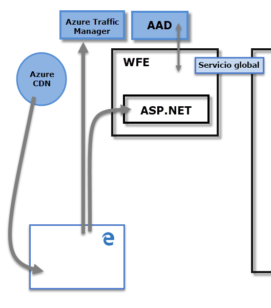
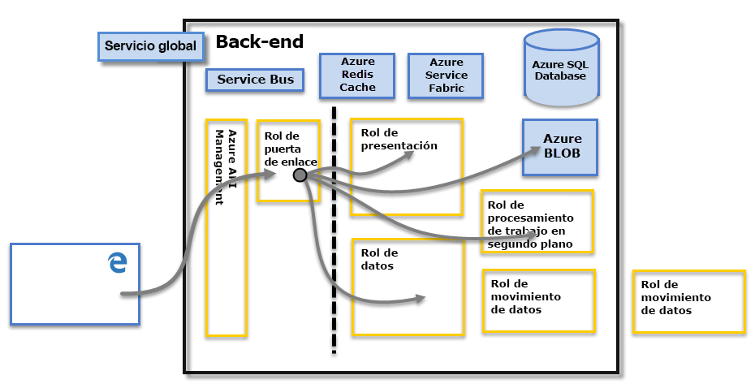

# Seguridad de Power BI

Para obtener una explicación detallada de la seguridad de Power BI, [lea las notas del producto sobre seguridad de Power BI](../guidance/whitepaper-powerbi-security.md).

El servicio de Power BI se basa en **Azure**, que es la plataforma y la infraestructura de informática en la nube de Microsoft. La arquitectura de servicio de Power BI se basa en dos clústeres: el front-end web (**WFE**) y el **back-end**. El clúster WFE administra la conexión inicial y la autenticación en el servicio de Power BI y, una vez realizada la autenticación, el back-end controla todas las interacciones de usuario siguientes. Power BI usa Azure Active Directory (AAD) para almacenar y administrar identidades de usuario, y administra el almacenamiento de datos y metadatos con Azure Blob y Azure SQL Database, respectivamente.

## Arquitectura de Power BI

Cada implementación de Power BI consta de dos clústeres: un front-end web (**WFE**) y un **back-end**.

El clúster **WFE** administra el proceso de autenticación y conexión inicial para Power BI, con AAD para autenticar clientes y proporcionar tokens para conexiones de clientes siguientes al servicio de Power BI. Power BI también usa el **Administrador de tráfico de Azure** para dirigir el tráfico de usuario al centro de datos más cercano, según el registro DNS del cliente que intenta conectarse, durante el proceso de autenticación y para descargar archivos y contenido estático. Power BI usa **Azure Content Delivery Network** (CDN) para distribuir eficazmente el contenido estático y los archivos necesarios a los usuarios en función de la región geográfica.

El clúster **back-end** informa de cómo interactúan los clientes autenticados con el servicio de Power BI. El clúster **back-end** administra visualizaciones, paneles para el usuario, conjuntos de datos, informes, almacenamiento de datos, conexiones de datos, actualización de datos y otros aspectos de la interacción con el servicio de Power BI. El rol **Puerta de enlace** actúa como una puerta de enlace entre las solicitudes del usuario y el servicio de Power BI. Los usuarios no interactúan directamente con los roles distintos del rol **Puerta de enlace**. **Azure API Management** controlará finalmente el rol **Puerta de enlace**.

> [!IMPORTANT]
> Es imprescindible recordar que solo los roles **Azure API Management** (APIM) y **Puerta de enlace** (GW) son accesibles mediante la red pública de Internet. Proporcionan autenticación, autorización, protección DDoS, limitación, equilibrio de carga, enrutamiento y otras capacidades.

## Seguridad del almacenamiento de datos

Power BI utiliza dos repositorios principales para almacenar y administrar datos: los datos cargados por los usuarios se envían normalmente a **Azure Blob Storage** y todos los metadatos, así como los artefactos para el propio sistema, se almacenan en **Azure SQL Database**.

La línea de puntos en la imagen del clúster del **back-end** anterior aclara el límite entre los dos únicos componentes a los que los usuarios pueden obtener acceso (a la izquierda de la línea de puntos) y los roles a los que únicamente puede obtener acceso el sistema. Cuando un usuario autenticado se conecta al servicio de Power BI, la conexión y cualquier solicitud del cliente se acepta y administra mediante el rol **Puerta de enlace** (para que lo administre finalmente **Azure API Management**), que luego interactúa en nombre del usuario con el resto del servicio de Power BI. Por ejemplo, cuando un cliente intenta ver un panel, el rol **Puerta de enlace** acepta la solicitud y, a continuación, envía de forma independiente una solicitud al rol **Presentación** para recuperar los datos necesarios para que el explorador muestre el panel.

## Autenticación de usuarios

Power BI usa Azure Active Directory ([AAD](https://azure.microsoft.com/services/active-directory/)) para autenticar a los usuarios que inician sesión en el servicio Power BI y, a su vez, usa las credenciales de inicio de sesión de Power BI siempre que un usuario intenta acceder a recursos que requieren autenticación. Los usuarios inician sesión en el servicio Power BI con la dirección de correo electrónico usada para establecer la cuenta de Power BI; Power BI usa ese correo electrónico de inicio de sesión como *nombre de usuario en vigor* y lo pasa a los recursos cuando un usuario intenta conectarse a los datos. El *nombre de usuario efectivo* se asigna después a un [*Nombre principal de usuario* (UPN)](/windows/win32/secauthn/user-name-formats) y se resuelve en la cuenta de dominio de Windows asociada, en la que se aplica la autenticación.

Para las organizaciones que usaron mensajes de correo electrónico de trabajo para el inicio de sesión de Power BI (como <em>david@contoso.com</em>, el *nombre de usuario eficaz* para la asignación de UPN es sencillo. Las organizaciones que no usaron correos electrónicos de trabajo para el inicio de sesión de Power BI (como <em>david@contoso.onmicrosoft.com</em>, la asignación entre AAD y las credenciales locales) requerirán una [sincronización de directorios](/azure/active-directory-domain-services/synchronization) para funcionar correctamente.

La seguridad de la plataforma de Power BI también incluye una seguridad de entorno de varios inquilinos, una seguridad de red y la capacidad de agregar medidas de seguridad basadas en AAD.

## Seguridad de datos y servicios

Para más información, visite el [Centro de confianza de Microsoft](https://www.microsoft.com/trustcenter).

Como se describió anteriormente en este artículo, los servidores de Active Directory locales usan el inicio de sesión de un usuario en Power BI para realizar la asignación a UPN para las credenciales. Sin embargo, es **importante** tener en cuenta que los usuarios son responsables de los datos que comparten: si un usuario se conecta a orígenes de datos con sus credenciales y luego comparte un informe (panel o conjunto de datos) en función de esos datos, los usuarios con los que se comparte el panel no se autentican en el origen de datos original y se les concederá acceso al informe.

Una excepción son las conexiones a **SQL Server Analysis Services** mediante una **puerta de enlace de datos local**; los paneles se almacenan en caché en Power BI, pero el acceso a los conjuntos de datos o los informes subyacentes inicia la autenticación del usuario que intenta acceder al informe (o conjunto de datos) y solo se concede acceso si el usuario tiene credenciales suficientes para acceder a los datos. Para más información, consulte la página [Detalles sobre la puerta de enlace de datos local](../connect-data/service-gateway-onprem-indepth.md).

## Aplicación del uso de la versión TLS

Los administradores de redes y TI pueden aplicar el requisito de utilizar la configuración de TLS (seguridad de la capa de transporte) actual para cualquier comunicación segura en su red. Windows proporciona compatibilidad para versiones de TLS a través de Microsoft Schannel Provider, como [se describe en el artículo sobre Schannel SSP de TLS](https://docs.microsoft.com/windows/desktop/SecAuthN/protocols-in-tls-ssl--schannel-ssp-).

Esta aplicación puede realizarse estableciendo administrativamente las claves del Registro. La aplicación se describe en el artículo [Administración de conjuntos de cifrado y protocolos SSL/TLS de AD FS](https://docs.microsoft.com/windows-server/identity/ad-fs/operations/manage-ssl-protocols-in-ad-fs). 

**Power BI Desktop** respeta la configuración de clave del Registro descrita en estos artículos y solo crea las conexiones que usan la versión de TLS permitida según esa configuración del Registro, cuando está presente.

Para obtener más información acerca de cómo establecer estas claves del Registro, consulte el artículo [Configuración del registro de seguridad de la capa de transporte (TLS)](https://docs.microsoft.com/windows-server/security/tls/tls-registry-settings).
