# Configuración y administración de capacidades en Power BI Premium

La administración de Power BI Premium implica la creación, administración y supervisión de las capacidades Premium. En este artículo se brindan instrucciones detalladas. Si necesita información general sobre las capacidades, consulte [Administración de las capacidades Premium](service-premium-capacity-manage.md).

Aprenda a administrar las capacidades de Power BI Premium y Power BI Embedded, que ofrecen recursos dedicados para su contenido.

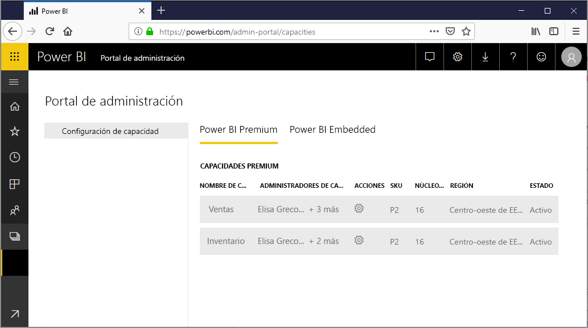

La *capacidad* es el núcleo de las ofertas Power BI Premium y Power BI Embedded. Es un conjunto de recursos reservados para uso exclusivo por parte de la organización. Tener capacidad dedicada le permite publicar paneles, informes y conjuntos de datos para los usuarios de su organización sin tener que adquirir licencias por usuario para ellos. También ofrece un rendimiento confiable y continuo del contenido hospedado en la capacidad. Para más información, consulte [What is Power BI Pro?](service-premium-what-is.md) (¿Qué es Power BI Premium?).

## Administración de capacidad

Cuando haya adquirido los nodos de capacidad en Microsoft 365, configure la capacidad en el portal de administración de Power BI. Las capacidades de Power BI Premium se administran en la sección de **configuración de la capacidad** del portal.

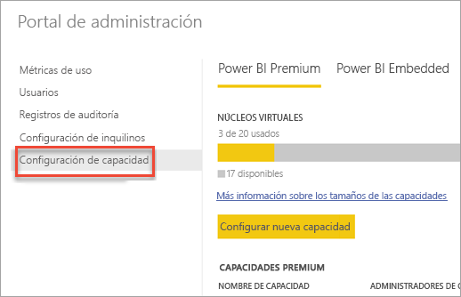

Para administrar una capacidad, seleccione el nombre de la misma. Después de hacerlo, irá a la pantalla de administración de la capacidad.

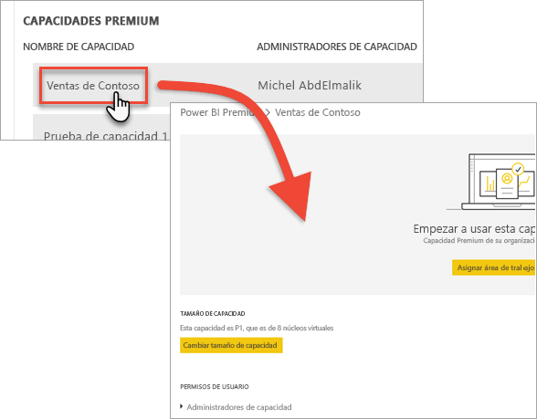

Si no se han asignado áreas de trabajo a la capacidad, verá un mensaje que le permite [asignar una área de trabajo a la capacidad](#assign-a-workspace-to-a-capacity).

### Configuración de una nueva capacidad (Power BI Premium)

El portal de administración muestra el número de *núcleos virtuales* que ha utilizado y que aún están disponibles. El número total de núcleos virtuales se basa en las SKU Premium que ha adquirido. Por ejemplo, si compra una P3 y una P2, habrá 48 núcleos disponibles (32 de P3 y 16 de P2).

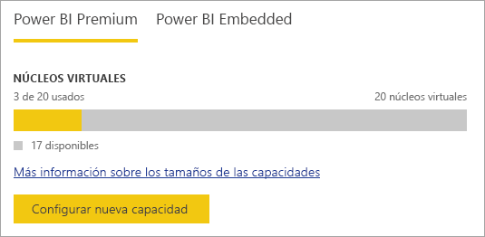

Si tiene núcleos virtuales disponibles, puede configurar la nueva capacidad siguiendo los pasos siguientes.

1. Seleccione **Configurar nueva capacidad**.

1. Otorgue un nombre a la capacidad.

1. Defina quién es el administrador de esta capacidad.

1. Seleccione el tamaño de la capacidad. Las opciones disponibles dependen de cuántos núcleos virtuales disponibles haya. No se puede seleccionar una opción mayor que lo que hay disponible.

    

1. Seleccione **Configurar**.

    

Los administradores de capacidad, así como los administradores y los administradores globales de Power BI, podrán ver posteriormente la capacidad en el portal de administración.

### Configuración de la capacidad

1. En la pantalla de administración de la capacidad Premium, bajo **Acciones**, seleccione el **icono de engranaje** para revisar y actualizar la configuración. 

    

1. Puede ver quiénes son los administradores del servicio, la SKU o el tamaño de la capacidad, y en qué región está.

    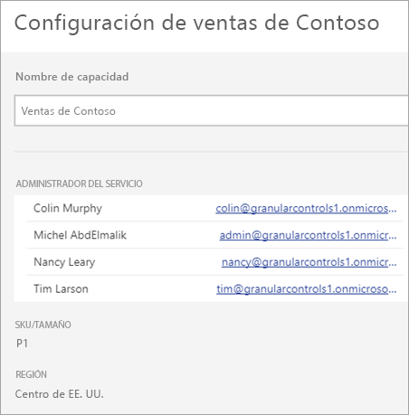

1. También puede cambiar el nombre de una capacidad o eliminarla.

    

> [!NOTE]
> La configuración de la capacidad de Power BI Embedded se administra en Microsoft Azure Portal.

### Cambiar tamaño de capacidad

Los administradores y administradores globales de Power BI pueden cambiar la capacidad Power BI Premium. Los administradores de capacidad que no sean administradores o administradores globales de Power BI no tendrán esta opción.

1. Seleccione **Cambiar tamaño de capacidad**.

    

1. En la pantalla **Cambiar tamaño de capacidad**, aumente o reduzca la capacidad, según corresponda.

    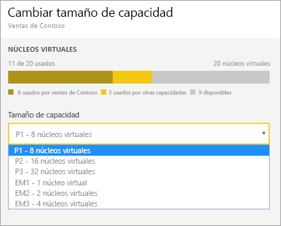

    Los administradores pueden crear, cambiar el tamaño y eliminar nodos libremente, siempre y cuando tengan el número necesario de núcleos virtuales.

    Las SKU P no se pueden reducir a SKU EM. Al mantener el puntero sobre cualquier opción deshabilitada, verá una explicación.

> [!IMPORTANT]
> Si la capacidad de Power BI Premium experimenta un uso elevado de los recursos, lo que da lugar a incidencias de rendimiento o fiabilidad, se pueden recibir mensajes de correo electrónico de notificación para identificar y resolver la incidencia en cuestión. Para obtener más información, vea las [notificaciones de capacidad y fiabilidad](service-interruption-notifications.md#capacity-and-reliability-notifications).

### Administración de permisos de usuario

Puede asignar administradores de capacidad adicionales, así como asignar los usuarios que tengan permisos de *asignación de capacidad*. Los usuarios que tengan permisos de asignación pueden asignar un área de trabajo a una capacidad, siempre que sean administradores de esa área de trabajo. También pueden asignar *Mi área de trabajo* personal a la capacidad. Los usuarios con permisos de asignación no tienen acceso al portal de administración.

> [!NOTE]
> Para Power BI Embedded, los administradores de capacidad se definen en Microsoft Azure Portal.

En **Permisos de usuario**, expanda **Usuarios con permisos de asignación** y, a continuación, agregue usuarios o grupos según corresponda.

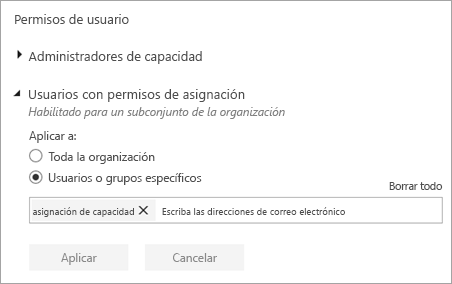

## Asignación de un área de trabajo a una capacidad

Hay dos maneras de asignar un área de trabajo a una capacidad: en el portal de administración y desde el área de trabajo.

### Asignación desde el portal de administración

Los administradores de capacidad, junto con los administradores y administradores globales de Power BI pueden asignar en masa áreas de trabajo en la sección de administración de la capacidad Premium del portal de administración. Al administrar una capacidad, se muestra una sección **Áreas de trabajo** que permite asignar áreas de trabajo.

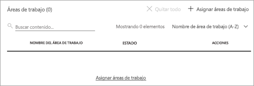

1. Seleccione **Asignar áreas de trabajo**. Esta opción está disponible en varios lugares.

1. Seleccione una opción para **Aplicar a**.

    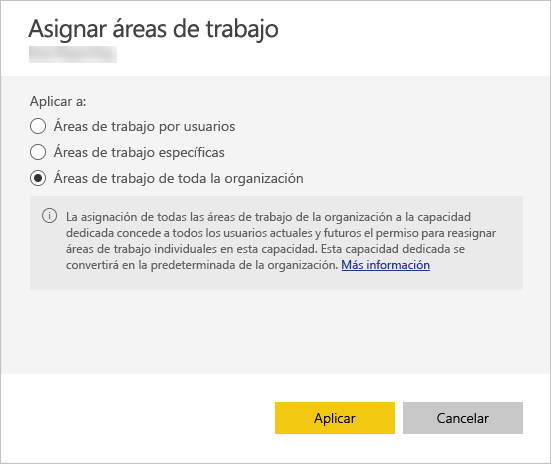

   | Selección | Descripción |
   | --- | --- |
   | **Áreas de trabajo por usuarios** | Al asignar áreas de trabajo por usuario o grupo, todas las áreas de trabajo que pertenecen a esos usuarios se asignan a la capacidad Premium, incluida el área de trabajo personal del usuario. Estos usuarios obtendrán automáticamente permisos de asignación de área de trabajo. Esto incluye las áreas de trabajo ya asignadas a una capacidad diferente. |
   | **Áreas de trabajo específicas** | Escriba el nombre de un área de trabajo específica para asignar a la capacidad seleccionada. |
   | **Áreas de trabajo de toda la organización** | La asignación de las áreas de trabajo de toda una organización a la capacidad Premium asigna todas las áreas de trabajo y Mis áreas de trabajo, en una organización, a esta capacidad Premium. Además, todos los usuarios actuales y los futuros tendrán permiso para reasignar las áreas de trabajo individuales a esta capacidad. |
   | | |

1. Seleccione **Aplicar**.

### Asignación desde la configuración del área de trabajo

También se puede asignar un área de trabajo a una capacidad Premium desde la configuración del área de trabajo. Para mover un área de trabajo a una capacidad, debe tener permisos de administrador sobre esa área de trabajo, así como permisos de asignación de capacidad para esa capacidad. Tenga en cuenta que los administradores de áreas de trabajo siempre pueden quitar un área de trabajo de la capacidad Premium.

1. Para editar un área de trabajo seleccione el icono de puntos suspensivos **(. . .)** y, después, seleccione **Editar área de trabajo**.

    

1. En **Editar área de trabajo**, expanda **Avanzado**.

1. Seleccione la capacidad a la que desea asignar esta área de trabajo.

    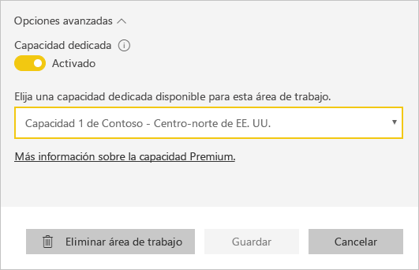

1. Seleccione **Guardar**.

Una vez guardada, el área de trabajo y todo lo que contiene se mueve a la capacidad Premium sin que los usuarios finales experimenten ninguna interrupción.

## Clave de producto del servidor de informes de Power BI

En la pestaña **Configuración de la capacidad** del portal de administración de Power BI, tendrá acceso a la clave de producto de Power BI Report Server. Esta opción solo estará disponible para los administradores globales o los usuarios a quienes se haya asignado el rol de administrador del servicio Power BI, si ha comprado una SKU de Power BI Premium.

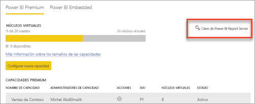

Al seleccionar **Clave del servidor de informes de Power BI**, se mostrará un cuadro de diálogo con su clave de producto. Puede copiarla y usarla en la instalación.

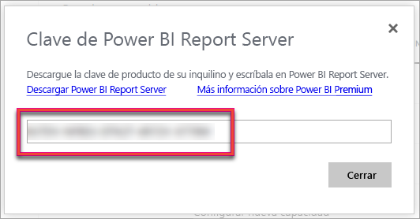

Para más información, consulte [Instalar un servidor de informes de Power BI](../report-server/install-report-server.md).

## Pasos siguientes

[Administración de las capacidades Premium](service-premium-capacity-manage.md)

¿Tiene más preguntas? [Pruebe a preguntar a la comunidad de Power BI](https://community.powerbi.com/)
