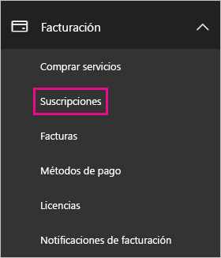
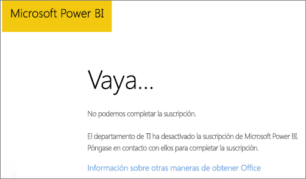

# <a name="unable-to-add-power-bi-to-office-365-partner-subscription"></a>No se puede agregar Power BI a la suscripción de asociado de Office 365

Microsoft 365 permite a las empresas revender Microsoft 365 empaquetado e integrado con sus propias soluciones, lo que proporciona a los clientes finales un único punto de contacto de compras, facturación y soporte técnico.

Si está interesado en adquirir Power BI, junto con su suscripción de Office 365, es recomendable que se ponga en contacto con su asociado para tal fin. Si su asociado no ofrece Power BI actualmente, existen diferentes opciones de compra.

## <a name="work-with-your-partner-to-purchase-power-bi"></a>Colaborar con su asociado para comprar Power BI

Si desea comprar una suscripción a Power BI Pro o Power BI Premium, consulte a su asociado para saber qué opciones hay:

* El asociado acuerda agregar Power BI a su cartera, para que pueda comprarle.

* El asociado puede realizar la transición a un modelo que le permita comprar Power BI directamente a Microsoft o a otro asociado que ofrezca Power BI.

## <a name="purchase-from-microsoft-or-another-channel"></a>Compra en Microsoft o en otro canal

Dependiendo de la relación con su asociado, puede comprar Power BI directamente a Microsoft o a otro asociado. Puede comprobar si puede agregar suscripciones de Power BI en el centro de administración de Microsoft 365 (requiere la pertenencia al rol Administrador Global o Administrador de facturación).

1. Vaya al [Centro de administración de Microsoft 365](https://admin.microsoft.com/AdminPortal/Home#/homepage).

1. En el menú izquierdo, abra **Facturación**:

    * Si ve **Suscripciones**, puede adquirir el servicio de Microsoft directamente o ponerse en contacto con otro asociado que ofrezca Power BI.

        

    * Si no ve **Suscripciones**, no puede realizar la compra directamente a Microsoft ni a otro asociado.

Si su asociado no ofrece Power BI y no puede realizar la compra directamente a Microsoft o a otro asociado, considere la posibilidad de suscribirse en una evaluación gratuita.

## <a name="sign-up-for-a-free-trial"></a>Registrarse para obtener una evaluación gratuita

Puede registrarse para obtener una evaluación gratuita de Power BI. Si no compra Power BI Pro al final del período de evaluación, todavía tiene una licencia gratuita que ofrece muchas de las características de Power BI. Para más información, consulte [Registro en Power BI como usuario individual](../fundamentals/service-self-service-signup-for-power-bi.md).

### <a name="enable-ad-hoc-subscriptions"></a>Habilitar las suscripciones ad hoc

De forma predeterminada, se deshabilitan los registros individuales, también conocidos como suscripciones ad hoc. En este caso, verá el siguiente mensaje cuando intente iniciar sesión: *El departamento de TI ha desactivado la suscripción de Microsoft Power BI*.



Para habilitar las suscripciones de ad hoc, puede ponerse en contacto con un asociado y solicitar su activación. Si es un administrador del inquilino y sabe cómo usar los comandos de PowerShell de Azure Active Directory, puede habilitar las suscripciones ad hoc usted mismo. [PowerShell de Azure Active Directory para Graph](/powershell/azure/active-directory/install-adv2/)

1. Inicie sesión en Azure Active Directory con sus credenciales de Microsoft 365. La primera línea del siguiente script le pide las credenciales. La segunda línea se conecta a Azure Active Directory.

    ```powershell
    $msolcred = get-credential
    connect-msolservice -credential $msolcred
    ```

    

1. Una vez que inicie sesión, ejecute el siguiente comando para comprobar la configuración actual de `AllowAdHocSubscriptions`.

    ```powershell
    Get-MsolCompanyInformation
    ```

1. Ejecute el siguiente comando para habilitar los registros gratuitos.

    ```powershell
    Set-MsolCompanySettings -AllowAdHocSubscriptions $true
    ```

## <a name="next-steps"></a>Pasos siguientes

[Licencias de Power BI en la organización](service-admin-licensing-organization.md)

¿Tiene más preguntas? [Pruebe a preguntar a la comunidad de Power BI](https://community.powerbi.com/)