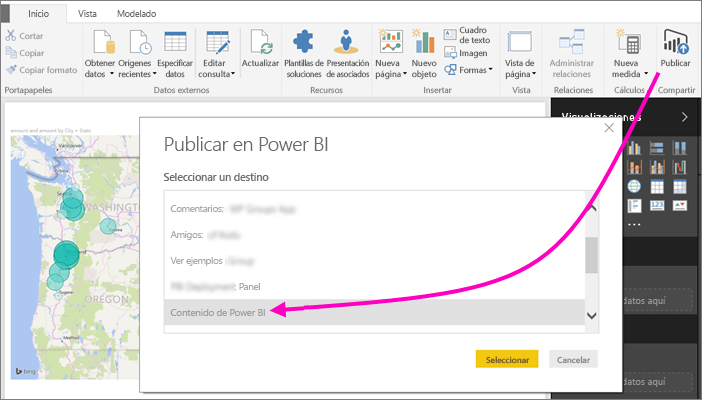
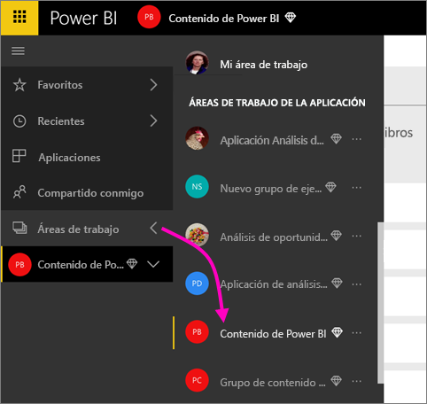
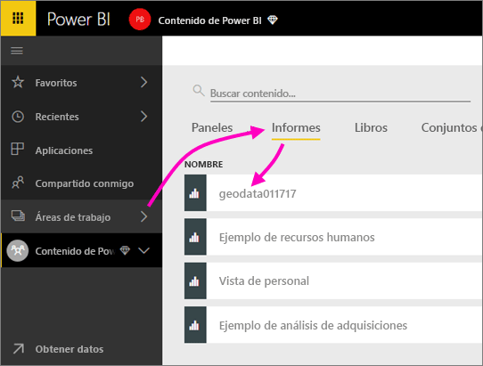
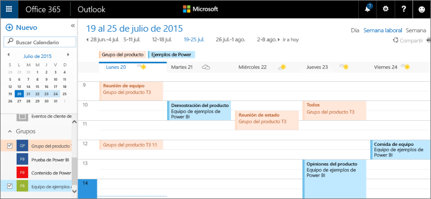

# Colaboración en un área de trabajo clásica
Las áreas de trabajo de Power BI son lugares excelentes para colaborar con sus compañeros de trabajo en paneles, informes y conjuntos de datos para crear *aplicaciones*. En este artículo, se proporciona información sobre las áreas de trabajo *clásicas* originales.  

La colaboración no termina con las áreas de trabajo en Power BI. Al crear una de las áreas de trabajo clásicas en Power BI, se crea automáticamente un grupo de Microsoft 365 en segundo plano. Microsoft 365 ofrece otros servicios de grupo, como el uso compartido de archivos en OneDrive para la Empresa, las conversaciones de Exchange, tareas y calendario compartidos, etc. Más información sobre [grupos en Microsoft 365](https://support.office.com/article/Create-a-group-in-Office-365-7124dc4c-1de9-40d4-b096-e8add19209e9).

> [!NOTE]
> La nueva experiencia de áreas de trabajo cambiará la relación entre las áreas de trabajo de Power BI y los grupos de Microsoft 365. Al crear una de las nuevas áreas de trabajo en Power BI, ya no se creará automáticamente un grupo de Microsoft 365 en segundo plano. Para obtener más información, consulte [Crear nuevas áreas de trabajo en Power BI](service-create-the-new-workspaces.md).

Para crear un área de trabajo, se necesita una [licencia de Power BI Pro](../fundamentals/service-features-license-type.md).

## Colaboración en archivos de Power BI Desktop en un área de trabajo
Después de crear un archivo de Power BI Desktop, puede publicarlo en un área de trabajo para que todos los miembros del área de trabajo puedan colaborar en este.

1. En Power BI Desktop, seleccione **Publicar** en la cinta de opciones **Inicio** y, en el cuadro **Seleccionar un destino**, seleccione el área de trabajo.
   
    
2. En el servicio Power BI, haga clic en la flecha junto a **Áreas de trabajo** > seleccione el área de trabajo.
   
    
3. Seleccione la pestaña **Informes** y, después, el informe.
   
    
   
    A partir de aquí, es como cualquier otro informe de Power BI. Todos los usuarios del área de trabajo pueden modificar el informe y guardar los iconos en el panel que prefiera.

## Colaboración en Microsoft 365
La colaboración en Microsoft 365 empieza en el área de trabajo clásica de Power BI.

1. En el servicio Power BI, seleccione la flecha situada junto a **Áreas de trabajo**, seleccione **Más opciones** (...) junto al nombre del área de trabajo. 
   
   
2. En este menú, puede colaborar con su grupo de varias maneras: 
   
   * Mantener una [conversación de grupo en Microsoft 365](#have-a-group-conversation-in-microsoft-365).
   * [Programar un evento](#schedule-an-event-on-the-group-workspace-calendar) en el calendario del área de trabajo de grupo.
   
   La primera vez que vaya a su área de trabajo de grupo de Microsoft 365, puede tardar algún tiempo. Espere de 15 a 30 minutos y actualice el explorador.

## Mantenimiento de una conversación de grupo en Microsoft 365
1. Seleccione **Más opciones** (…) junto al nombre del área de trabajo \> **Conversaciones**. 
   
    
   
   El sitio de correo electrónico y conversación del área de trabajo de grupo se abrirá en Outlook para Microsoft 365.
   
   
2. Obtenga más información sobre las [conversaciones en grupo en Outlook para Microsoft 365](https://support.office.com/Article/Have-a-group-conversation-a0482e24-a769-4e39-a5ba-a7c56e828b22).

## Programación de un evento en el calendario del área de trabajo de grupo
1. Seleccione **Más opciones** (…) junto al nombre del área de trabajo \> **Calendario**. 
   
   
   
   El calendario del área de trabajo de grupo se abrirá en Outlook para Microsoft 365.
   
   
2. Obtenga más información sobre los [calendarios de grupo de Outlook en Microsoft 365](https://support.office.com/Article/Add-edit-and-subscribe-to-group-events-0cf1ad68-1034-4306-b367-d75e9818376a).

## Administración de un área de trabajo clásica
Si es el propietario o administrador de un área de trabajo, puede agregar o quitar miembros del área de trabajo. Obtenga más información sobre cómo [administrar un área de trabajo de Power BI](service-manage-app-workspace-in-power-bi-and-office-365.md).

## Pasos siguientes
* [Publicar aplicaciones en Power BI](service-create-distribute-apps.md).
* ¿Tiene más preguntas? [Pruebe la comunidad de Power BI](https://community.powerbi.com/).
* Comentarios Visite [Ideas sobre Power BI](https://ideas.powerbi.com/forums/265200-power-bi).
