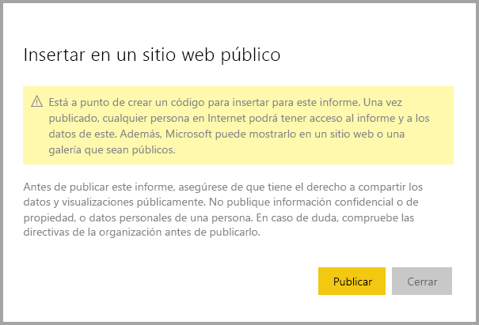
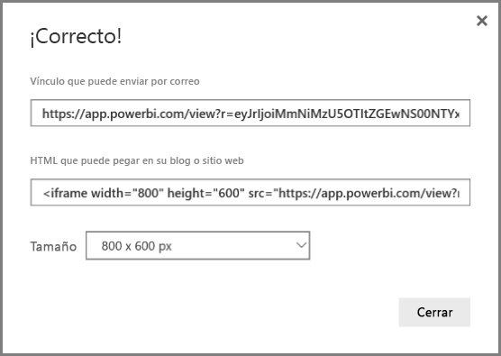
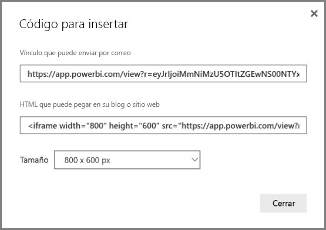
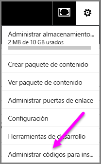
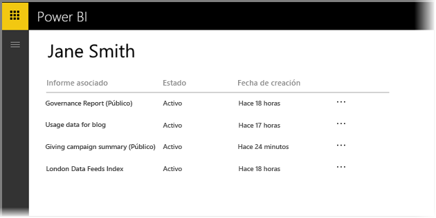
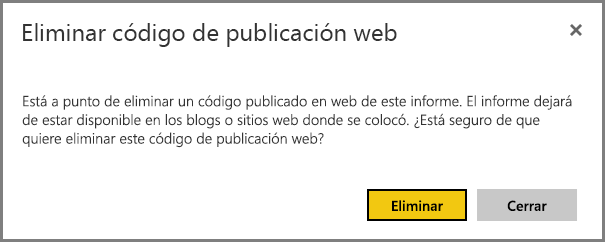

# Publicar en la web de Power BI

Con la opción **Publicar en la web de Power BI**, puede insertar fácilmente contenido interactivo de Power BI en entradas de blog, sitios web, mensajes de correo electrónico o redes sociales. También puede editar, actualizar o dejar de compartir fácilmente los objetos visuales publicados.

> [!WARNING]
> Al usar la característica **Publicar en la web**, cualquier usuario podrá ver en Internet el informe o el objeto visual que publique. Para la visualización no se requiere autenticación. Se incluye la visualización de los datos de nivel de detalle que agreguen los informes. Antes de publicar un informe, asegúrese de que está de acuerdo en compartir los datos y las visualizaciones públicamente. No publique información confidencial o de su propiedad. En caso de duda, compruebe las directivas de la organización antes de publicarlo.

>[!Note]
>Puede insertar el contenido de forma segura en un portal interno o sitio web. Use las opciones [Insertar](service-embed-secure.md) o [Insertar en SharePoint Online](service-embed-report-spo.md). Estas opciones garantizan que se aplican todos los permisos y la seguridad de los datos cuando los usuarios ven sus datos internos.

## Creación de códigos para insertar con Publicar en la web

**Publicar en la web** está disponible en informes que se pueden editar en áreas de trabajo personales o de grupo.  No está disponible para los informes que se comparten con usted o que dependen de la seguridad de nivel de fila para proteger los datos. Consulte la sección [**Limitaciones**](#limitations) más adelante para obtener una lista completa de los casos en los que no se admite **Publicar en la web**. Revise la **Advertencia** mencionada anteriormente en este artículo antes de usar la característica **Publicar en la web**.

El siguiente vídeo corto muestra cómo funciona esta característica. Luego, pruébelo usted mismo en los pasos siguientes.

<iframe width="560" height="315" src="https://www.youtube.com/embed/UF9QtqE7s4Y" frameborder="0" allowfullscreen></iframe>

Los pasos siguientes describen cómo usar la característica **Publicar en Web**.

1. Abra un informe en un área de trabajo que pueda editar y seleccione **Más opciones (…)**   > **Insertar** > **Publicar en la web (público)** .

   
   
2. Si el administrador de Power BI no le ha permitido crear códigos para insertar, puede que tenga que ponerse en contacto con él o ella.

   
   
   Para saber cómo encontrar a la persona que puede habilitar la característica Publicar en la web en su organización, consulte [Buscar el administrador de Power BI](#find-your-power-bi-administrator) más adelante en este artículo.

3. Revise el contenido del cuadro de diálogo y seleccione **Crear código para insertar**.

   

4. Revise la advertencia, tal como se muestra aquí, y confirme que los datos se pueden insertar en un sitio web público. Si es así, seleccione **Publicar**.

   

5. Aparece un cuadro de diálogo con un vínculo. Seleccione el vínculo para enviarlo por correo electrónico o copie el código HTML. Puede insertarlo en el código como un iFrame o pegarlo directamente en una página web o blog.

   

6. Si se ha creado previamente un código para insertar para un informe y se ha seleccionado **Publicar en la web**, no verá los cuadros de diálogo en los pasos 2 a 4. En su lugar, el cuadro de diálogo **Código para insertar** se muestra como sigue:

   

   Solo se puede crear un código para insertar por informe.

### Sugerencias para modos de vista

Al insertar contenido en una entrada de blog, normalmente debe ajustarlo en un tamaño de pantalla concreto.  Se puede ajustar el alto y el ancho de la etiqueta de iFrame según sea necesario. Sin embargo, deberá asegurarse de que el informe se ajusta en el área determinada del iFrame, por lo que también deberá establecer un Modo de vista adecuado al editar el informe.

En la tabla siguiente se proporcionan instrucciones sobre el modo de vista y cómo va a aparecer al insertarse.

| Modo de vista | Aspecto que tiene al insertarse |
| --- | --- |
|  |**Ajustar a la página** respeta el alto y ancho de la página del informe. Si establece la página en proporciones *dinámicas*, como 16:9 o 4:3, el contenido se escalará para que quepa en el iFrame. Cuando se inserta en un iFrame, el uso de **Ajustar a la página** puede dar como resultado un *formato de pantalla ancha*, en el que se muestra un fondo gris en las áreas del iFrame después de que el contenido se escale para ajustarlo en dicho iFrame. Para minimizar el formato de pantalla ancha, establezca el alto y ancho del iFrame adecuadamente. |
|  |**Tamaño real** garantiza que el informe conserve su tamaño tal como está establecido en la página del informe. Esto puede causar que se muestren barras de desplazamiento en el iFrame. Establezca el alto y ancho de iFrame para evitar las barras de desplazamiento. |
|  |**Ajustar al ancho** garantiza que el contenido rellene el área horizontal del iFrame. Se sigue mostrando un borde, pero el contenido se escala para usar todo el espacio horizontal disponible. |

### Sugerencias para el ancho y alto de iFrame

Un código para insertar de **Publicar en la web** se parece al siguiente ejemplo:

 
Puede editar el ancho y alto manualmente para asegurarse de que es precisamente como quiere que se ajuste a la página en la que lo está insertando.

Para lograr un ajuste más exacto, se puede intentar la adición de 56 píxeles al alto del iFrame para acomodar el tamaño actual de la barra inferior. Si la página del informe usa el tamaño dinámico, la siguiente tabla proporciona algunos tamaños que se pueden usar para obtener un ajuste sin formato de pantalla ancha.

| Proporción | Tamaño | Dimensiones (ancho x alto) |
| --- | --- | --- |
| 16:9 |Pequeño |640 x 416 px |
| 16:9 |Mediana |800 x 506 px |
| 16:9 |Grande |960 x 596 px |
| 4:3 |Pequeño |640 x 536 px |
| 4:3 |Mediana |800 x 656 px |
| 4:3 |Grande |960 x 776 px |

## Administrar códigos para insertar

Después de crear un código para insertar de **Publicar en la web**, se pueden administrar los códigos desde el menú **Configuración** en Power BI. La administración de códigos para insertar incluye la capacidad de quitar el objeto visual o informe de destino de un código (lo que deja inutilizable el código para insertar), o la obtención del código para insertar.

1. Para administrar sus códigos para insertar de **Publicar en Web** , abra el engranaje de **Configuración** y seleccione **Administrar códigos para insertar**.

   

2. Aparecen los códigos para insertar.

   

3. Se puede recuperar o eliminar un código para insertar. Si se elimina, se deshabilitan todos los vínculos a ese informe u objeto visual.

   

4. Si se selecciona **Eliminar**, se le solicita una confirmación.

   

## Actualizaciones de informes y datos

Después de crear y compartir el código para insertar de **Publicar en la web**, el informe se actualiza con los cambios que realice y el vínculo del código para insertar se activa de forma inmediata. Cualquiera que abra el vínculo puede verlo. Sin embargo, después de esta acción inicial, las actualizaciones de los informes u objetos visuales pueden tardar entre dos y tres horas antes de convertirse en visibles para los usuarios. Para obtener más información, consulte la sección [**Cómo funciona**](#howitworks) más adelante en este artículo. 

### Actualización de datos

Las actualizaciones de datos se reflejan automáticamente en el informe u objeto visual insertado. Los datos actualizados pueden tardar aproximadamente una hora en ser visibles desde los códigos para insertar. Para desactivar la actualización automática, seleccione **no actualizar** en la programación del conjunto de datos que usa el informe.  

## Objetos visuales de Power BI

Los objetos visuales de Power BI se admiten en **Publicar en la web**. Si usa **Publicar en la web**, los usuarios con los que comparta el objeto visual publicado no tendrán que habilitar los objetos visuales de Power BI para ver el informe.

## Descripción de la columna de estado de código para insertar

>[!Note]
>Revise los códigos para insertar que ha publicado a menudo. Quite los que ya no tengan que estar disponibles públicamente.

La página **Administrar códigos para insertar** incluye una columna de estado. De forma predeterminada, el estado de los códigos para insertar es **Activo**, pero también podría ser uno de los que se enumeran debajo.

| Estado | Descripción |
| --- | --- |
| **Activo** |El informe está disponible para que los usuarios de Internet lo vean e interactúen con él. |
| **Bloqueado** |El contenido del informe infringe las [Condiciones del servicio de Power BI](https://powerbi.microsoft.com/terms-of-service). Microsoft lo ha bloqueado. Si cree que el contenido se ha bloqueado por error, póngase en contacto con soporte técnico. |
| **No admitido** |El conjunto de datos del informe usa la seguridad de nivel de fila u otra configuración no admitida. Consulte la sección [**Limitaciones**](#limitations) para obtener una lista completa. |
| **Infracción** |El código para insertar está fuera de la directiva de inquilino definida. Este estado suele producirse cuando se ha creado un código para insertar y se ha cambiado la configuración del inquilino **Publicar en la web** para excluir al usuario que posee el código para insertar. Si la configuración del inquilino está deshabilitada o el usuario ya no tiene permiso para crear códigos para insertar, los códigos para insertar existentes se muestran con el estado **Infracción**. Para obtener más información, consulte la sección [Buscar el administrador de Power BI](#find-your-power-bi-administrator) de este artículo. |

## Notificación de un problema con el contenido de Publicar en la web

Para informar de un problema relacionado con el contenido de **Publicar en la web** insertado en un sitio web o un blog, use el icono **Marca** en la barra inferior del informe **Publicar en la web**.

Se le pedirá que envíe un correo electrónico a Microsoft para explicar el problema. Microsoft evaluará el contenido en función de las [Condiciones del servicio de Power BI](https://powerbi.microsoft.com/terms-of-service) y tomará las medidas adecuadas.

## Licencias

Debe ser usuario de Microsoft Power BI para poder usar la características **Publicar en Web**. No es necesario que las personas que ven el informe sean usuarios de Power BI.

## Cómo funciona (detalles técnicos)

Cuando se crea un código para insertar mediante **Publicar en la web**, el informe se hace visible para los usuarios de Internet. Está disponible públicamente, por lo que se puede esperar que los espectadores compartan fácilmente el informe a través de redes sociales en el futuro. Cuando los usuarios ven el informe, ya sea con la dirección URL pública directa o insertado en una página web o un blog, Power BI almacena en caché la definición de informe y los resultados de las consultas necesarias para ver el informe. Este almacenamiento en caché garantiza que miles de usuarios simultáneos pueden ver el informe sin afectar al rendimiento.

La memoria caché es de larga duración. Si actualiza la definición del informe (por ejemplo, si cambia el modo de vista) o los datos del informe, los cambios pueden tardar aproximadamente una hora en reflejarse en la versión del informe que ven los usuarios. Puesto que cada elemento y valor de datos se almacena en caché de forma independiente, cuando se produce una actualización de los datos, se puede mostrar una combinación de valores actuales y anteriores a un usuario. Por tanto, se recomienda organizar el trabajo con antelación y crear el código para insertar de **Publicar en la web** solo cuando esté satisfecho con la configuración. Si los datos se van a actualizar, minimice el número de actualizaciones y realice las actualizaciones en horas de inactividad.

## Buscar el administrador de Power BI

El portal de administración de Power BI tiene opciones de configuración que controlan quién puede publicar en la web. Trabaje con el [administrador de Power BI](../admin/service-admin-role.md) de la organización para cambiar la [configuración de inquilinos de publicación en la web](../admin/service-admin-portal.md#publish-to-web) en el portal de administración.

En el caso de las organizaciones más pequeñas o las personas que se han registrado en Power BI, es posible que aún no cuente con un administrador de Power BI. Siga nuestro [proceso de adquisición de administrador de inquilinos](https://docs.microsoft.com/azure/active-directory/users-groups-roles/domains-admin-takeover). Una vez que tenga un administrador de Power BI, puede habilitar la creación de códigos para insertar automáticamente.

Las organizaciones establecidas normalmente ya tienen un administrador de Power BI. Las personas de cualquiera de los roles siguientes pueden actuar como administrador de Power BI:

- Administradores globales
- Usuarios con el rol de administrador de servicios de Power BI en Azure Active Directory

Debe [buscar a una de estas personas](https://docs.microsoft.com/office365/admin/admin-overview/admin-overview#who-has-admin-permissions-in-my-business) en la organización y pedirle que actualice la [configuración de inquilinos de publicación en la web](../admin/service-admin-portal.md#publish-to-web) en el portal de administración.

## Limitaciones

**Publicar en la web** es compatible con la mayoría de los orígenes de datos e informes del servicio Power BI. Aun así, los siguientes tipos de informes no se admiten actualmente o no están disponibles con **Publicar en la web**:

- Informes que usan la seguridad de nivel de fila.
- Informes que usan cualquier origen de datos de conexión dinámica, incluido Analysis Services Tabular hospedado en local, Analysis Service Multidimensional y Azure Analysis Services.
- Informes que usan un [conjunto de datos compartido](../connect-data/service-datasets-across-workspaces.md) que se almacena en un área de trabajo diferente del informe.
- [Conjuntos de datos certificados y compartidos](../connect-data/service-datasets-share.md).
- Informes compartidos con usted directamente o a través de un paquete de contenido organizativo.
- Informes en un área de trabajo en la que no es miembro de edición.
- Los objetos visuales "R" no se admiten actualmente en informes de **Publicar en la web**.
- Exportación de datos desde los objetos visuales de un informe que se ha publicado en la web.
- Objetos visuales de ArcGIS Maps for Power BI.
- Informes que contienen medidas DAX de nivel de informe.
- Modelos de consulta de datos de inicio de sesión único.
- Información confidencial o de propiedad.
- La funcionalidad de autenticación automática que se incluye con la opción **Insertar** no funciona con la API de JavaScript para Power BI. Con la API de JavaScript para Power BI, use el enfoque de [usuario propietario de datos](../developer/embedded/embed-sample-for-your-organization.md) en la inserción.

## Pasos siguientes

- [Elemento web de informes de SharePoint Online](service-embed-report-spo.md) 

- [Inserción de informes en un sitio web o portal seguros](service-embed-secure.md)

¿Tiene más preguntas? [Pruebe la comunidad de Power BI](https://community.powerbi.com/)

