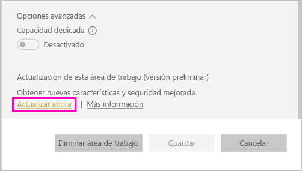
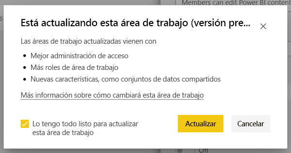
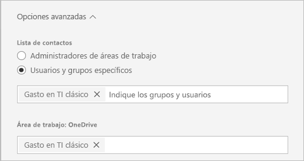
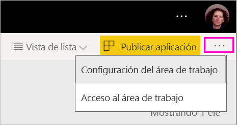
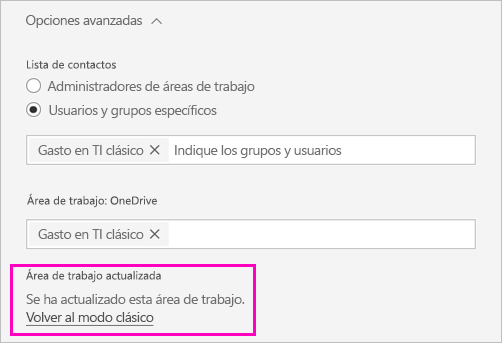
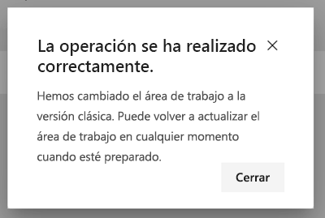

# Actualización de las áreas de trabajo clásicas a las áreas de trabajo nuevas en Power BI

En este artículo se explica cómo actualizar o *migrar* un área de trabajo clásica a la nueva experiencia de área de trabajo. Puede actualizar cualquier área de trabajo clásica. Las áreas de trabajo nuevas tienen roles de área de trabajo más pormenorizados para que pueda administrar de mejor manera el acceso al contenido. También dispone de mayor flexibilidad para administrar las áreas de trabajo actualizadas porque están conectadas de manera menos estricta a su grupo original de Microsoft 365. Obtenga información sobre la [experiencia de área de trabajo nueva](service-new-workspaces.md).

>[!NOTE]
>La actualización del área de trabajo está disponible como versión preliminar pública. 

Sin embargo, es posible que haya ciertos cambios en el área de trabajo que debe conocer y para los cuales deba planear acciones. Por ejemplo, los paquetes de contenido no se admiten en la experiencia de área de trabajo nueva. Consulte la sección [Consideraciones y limitaciones de la actualización](#upgrade-considerations-and-limitations), que aparece más adelante en este artículo.

## Tareas que se deben hacer después de la actualización

Es necesario hacer varias tareas *después* de actualizar. Es mejor planearlas *antes* de actualizar:
- Revise la lista de acceso y entienda los [permisos después de la actualización](#permissions-after-upgrade).
- Revise la [lista de contactos](#modify-the-contact-list) y asegúrese de que esté establecida según lo deseado.
- Si aún no lo ha hecho, aprenda sobre la [experiencia de área de trabajo nueva](service-new-workspaces.md).

## Actualización de un área de trabajo clásica

Cualquier administrador del área de trabajo puede actualizarla. En el caso de las áreas de trabajo clásicas, para ser administrador del área de trabajo debe ser Propietario del grupo de Microsoft 365 subyacente. Para actualizar un área de trabajo, siga estos pasos.

1. En la lista de contenido del área de trabajo, seleccione **Más opciones** ( **…** ) > **Editar esta área de trabajo**.

    

1. Expanda **Avanzado** y seleccione **Actualizar ahora**.

    

1. Revise la información del cuadro de diálogo. Verá advertencias si ha publicado o instalado paquetes de contenido en el área de trabajo. Cuando esté listo, active la opción **Lo tengo todo listo para actualizar esta área de trabajo** y seleccione **Actualizar**.

    

2. Durante la actualización, verá el mensaje **Actualizando**. Por lo general, actualizar el área de trabajo tarda menos de un minuto.

1. Cuando finaliza la actualización, verá el cuadro de diálogo **Operación completada correctamente**. Se recomienda leer [Organización del trabajo en las nuevas áreas de trabajo en Power BI](service-new-workspaces.md) para que sepa cómo las áreas de trabajo nuevas difieren de las clásicas.

### Impacto en otros usuarios del área de trabajo

Se recomienda realizar la actualización fuera del horario laboral, cuando son pocos los usuarios que consultan o editan de manera activa los elementos del área de trabajo.

A los usuarios que usan activamente el área de trabajo se les pide actualizar el explorador. Los usuarios que editan un informe tienen la opción de guardar los cambios antes de actualizar.

## Consideraciones y limitaciones de la actualización

- Las direcciones URL y los identificadores del área de trabajo, el contenido que incluye y la aplicación publicada desde el área de trabajo no cambian. El contenido de los paquetes de contenido instalados en el área de trabajo se administra por separado. Consulte la sección [Paquetes de contenido durante la actualización](#content-packs-during-upgrade) de este artículo para más detalles.
- Los paquetes de contenido no se admiten en la experiencia de área de trabajo nueva. Lea las secciones sobre los [paquetes de contenido publicados](#published-content-packs) o los [paquetes de contenido instalados](#installed-content-packs) para información sobre cómo se administran durante la actualización. Se recomienda eliminar los paquetes de contenido instalados o publicados en el área de trabajo antes de hacer la actualización.
- La actualización del área de trabajo en Power BI no afecta el grupo de Microsoft 365 para el área de trabajo clásica. Ningún equipo, sitio de SharePoint, buzón u otro recurso administrado por Microsoft 365 cambia. Permanecen intactos después de actualizar el área de trabajo de Power BI. El grupo de Microsoft 365 sigue existiendo tal como antes.
- Hay cambios en cómo se protege el área de trabajo después de la actualización. Consulte la sección de [permisos del área de trabajo después de actualizar](#permissions-after-upgrade) para más detalles.
- De ser necesaria, se proporciona una opción para **volver a un área de trabajo clásica**. Sin embargo, esta opción no restaura totalmente algunos aspectos del área de trabajo de antes de su actualización. Si empieza a usar características que solo funcionan en la experiencia de área de trabajo nueva, no podrá volver atrás. La opción para volver atrás está disponible durante 30 días a contar de la actualización.

## Permisos después de la actualización

Seleccione **Acceso** en la barra de menús que está en la parte superior de la lista de contenido del área de trabajo para revisar los permisos después de la actualización.

Cada Propietario de grupo de Microsoft 365 se agrega de manera individual al rol Administrador del área de trabajo actualizada. El propio grupo de Microsoft 365 se agrega a un rol de área de trabajo. El rol se agrega según si el área de trabajo clásica es *de solo lectura* o *de lectura y escritura*:

- Cuando el área de trabajo está establecida en **Los miembros pueden editar contenido de Power BI**, después de actualizar el grupo de Microsoft 365 se agrega a la lista de acceso del área de trabajo con el rol **Miembro**.
- Cuando el área de trabajo está establecida en **Los miembros solo pueden leer el contenido de Power BI**, después de actualizar el grupo de Microsoft 365 se agrega a la lista de acceso del área de trabajo con el rol **Espectador**.

Dado que el grupo de Microsoft 365 tiene un rol en el área de trabajo, cualquier usuario agregado al grupo de Microsoft 365 después de la actualización tiene ese rol en el área de trabajo. Sin embargo, si agrega Propietarios nuevos al grupo de Microsoft 365 después de la actualización, no tiene el rol Administrador del área de trabajo.

### Diferencias en los roles antes y después de actualizar

Los roles del área de trabajo son distintos en las áreas de trabajo clásicas y nuevas. La experiencia de área de trabajo nueva le permite conceder roles de área de trabajo a grupos de Microsoft 365, grupos de seguridad y listas de distribución.

- Los **miembros** pueden compartir elementos individuales y conceder acceso a toda el área de trabajo a través de los roles Miembro, Colaborador o Espectador.
- Los **espectadores** solo pueden ver el contenido y no pueden exportar los datos subyacentes ni analizar en Excel ningún conjunto de datos del área de trabajo, a menos que tengan el permiso de compilación.

Todo usuario con acceso a los elementos del área de trabajo a través del uso compartido o de un permiso de aplicación siguen teniendo acceso a esos elementos. Todo usuario con acceso al área de trabajo también tiene acceso a la aplicación publicada desde el área de trabajo. Estos usuarios no aparecen en la lista de acceso de la aplicación.

Se recomienda evaluar si se debe usar el nuevo rol Colaborador. Después de la actualización, puede cambiar el grupo de Microsoft 365 para que tenga el rol Colaborador en el panel de acceso.

Después de la actualización, puede considerar la posibilidad de crear un grupo de seguridad o un grupo de Microsoft 365 o una lista de distribución para los administradores del área de trabajo, en lugar de administrar el acceso a través de asignaciones de roles a usuarios individuales.

Obtenga más información sobre los [roles en las áreas de trabajo nuevas](service-new-workspaces.md#roles-in-the-new-workspaces).

## Licencias después de la actualización

Los usuarios de los roles Administrador, Miembro o Colaborador del área de trabajo necesitan una licencias de Power BI Pro para acceder al área de trabajo.

Si el área de trabajo está en la capacidad compartida, los usuarios con el rol Espectador del área de trabajo también necesitarán una licencia de Power BI Pro para acceder al área de trabajo. Sin embargo, si el área de trabajo está en una capacidad Premium, los usuarios con el rol Espectador no necesitan una licencia Pro para acceder al área de trabajo.

## Otras características de las áreas de trabajo nuevas

La experiencia de área de trabajo nueva tiene características que las áreas de trabajo clásicas no tienen. Una diferencia es la capacidad de establecer una lista de contactos distinta de los propietarios o los administradores del área de trabajo. Una similitud es que sigue conectada a la biblioteca de documentos de SharePoint del grupo de Microsoft 365.

### Modificación de la lista de contactos

1. Seleccione **Configuración** en la barra de menús que se encuentra en la parte superior de la lista de contenido del área de trabajo para acceder a la configuración del área de trabajo.

    

2. En **Avanzado**, el área de trabajo **Lista de contactos** está configurada para ser el grupo de Microsoft 365 desde donde se actualizó el área de trabajo. Puede agregar más usuarios o grupos a la lista de contactos o cambiarla a los administradores del área de trabajo.

    

### El área de trabajo OneDrive 

Después de la actualización, el área de trabajo **OneDrive** se conecta a la biblioteca de documentos de SharePoint del grupo de Microsoft 365. Esta biblioteca de documentos muestra la opción **OneDrive** en la experiencia **Obtener datos > Archivos**. Tenga en cuenta que es posible que no todos los usuarios del área de trabajo tengan permiso para esa biblioteca de documentos si no están en el grupo de Microsoft 365.

## Paquetes de contenido durante la actualización

La experiencia de área de trabajo nueva no admite los paquetes de contenido. En su lugar, puede usar aplicaciones y conjuntos de datos compartidos para distribuir contenido en el área de trabajo. Se recomienda quitar del área de trabajo los paquetes de contenido publicados o instalados antes de la actualización. Sin embargo, si hay paquetes de contenido publicados o instalados al realizar la actualización, el proceso de actualización intenta conservar el contenido, como se describe a continuación.  No hay ninguna manera de restaurar el paquete de contenido ni la asociación del contenido con el paquete de contenido después de la actualización.

### Paquetes de contenido publicados

Los paquetes de contenido publicados desde el área de trabajo se quitan durante la actualización. No podrá publicarlos ni actualizarlos después de la actualización, aunque vuelva al área de trabajo clásica. Si otros usuarios instalaron el paquete de contenido en sus propias áreas de trabajo, después de la actualización, verán una copia del contenido del paquete de contenido en sus áreas de trabajo. Consulte la sección **Paquetes de contenido instalados** para más detalles.

### Paquetes de contenido instalados

Cuando actualiza su área de trabajo o se actualiza el área de trabajo desde la que se publica el paquete de contenido, se producen cambios importantes en los paquetes de contenido instalados. Después de la actualización, el área de trabajo contiene una copia del contenido del paquete de contenido. Está conectado con el conjunto de datos original del área de trabajo original.

Sin embargo, hay cambios importantes:

- El contenido ya no se actualizará si se actualiza el paquete de contenido.
- Los identificadores de elementos y las direcciones URL cambian y requieren que se actualicen los marcadores o vínculos que haya compartido con otros usuarios.
- Se perderán las personalizaciones de usuario del paquete de contenido original del área de trabajo. Las personalizaciones incluyen suscripciones, alertas, marcadores personales, filtros persistentes y favoritos.
- Es posible que los usuarios nuevos no tengan acceso a los conjuntos de valores que estaban en el paquete de contenido. Necesita trabajar con el propietario del conjunto de datos para asegurarse de que los usuarios del área de trabajo tengan acceso a los datos.

## Reversión a un área de trabajo clásica

Como parte de la experiencia de actualización, durante 30 días a contar de la actualización tiene la opción de volver a un área de trabajo clásica. Esta funcionalidad restaura la asociación del contenido del área de trabajo con el grupo de Microsoft 365 original. Está disponible en caso de que la organización encuentre problemas importantes con la experiencia de área de trabajo nueva. Sin embargo, hay limitaciones. Lea primero la sección [Consideraciones para volver al área de trabajo clásica](#considerations-for-switching-back-to-classic) de este artículo.

Para volver atrás, debe ser Propietario del grupo de Microsoft 365 con el que estaba asociada el área de trabajo antes de la actualización. Siga estos pasos.

1. En la lista de contenido del área de trabajo, seleccione **Más opciones** ( **…** ) > **Configuración del área de trabajo**.

    

1. Expanda **Avanzado** y seleccione **Switch back to classic** (Volver al área de trabajo clásica). Si esta opción no está disponible, consulte [Consideraciones para volver al área de trabajo clásica](#considerations-for-switching-back-to-classic) de este artículo.

    

1. Cuando esté listo, active la casilla **I'm ready to switch back to classic** (Estoy preparado para volver al área de trabajo clásica) y seleccione **Switch to classic** (Cambiar al área de trabajo clásica). Es posible que vea advertencias o bloqueadores en este cuadro de diálogo. Lea las [consideraciones para volver atrás](#considerations-for-switching-back-to-classic) que aparece en este artículo si se encuentra con estos problemas.

    

1. Cuando se complete la reversión, verá un cuadro de diálogo de confirmación.

    

### Consideraciones para volver al área de trabajo clásica

No es posible volver atrás si se cumple alguna de las afirmaciones siguientes sobre el área de trabajo:

- Se eliminó el grupo de Microsoft 365.
- Han transcurrido más de 30 días desde la actualización.
- Informes o paneles de otras áreas de trabajo usan los conjuntos de datos del área de trabajo en cuestión. ¿Cómo ocurre esto? Imagine que publicó un paquete de contenido desde el área de trabajo antes de la actualización y que algún usuario instaló el paquete de contenido en otra área de trabajo. Inmediatamente después de la actualización, los informes y paneles de ese paquete de contenido usan los conjuntos de datos.
- El área de trabajo forma parte de una canalización de administración del ciclo de vida de la aplicación.
- El área de trabajo se usa para las aplicaciones de plantilla.
- El área de trabajo usa la funcionalidad de modelos grandes.
- El área de trabajo usa la característica de métricas de uso nueva.

Al volver a un área de trabajo clásica, no se restaura una copia exacta del área de trabajo original. Se producen los cambios siguientes:

- Los permisos para el área de trabajo se establecen mediante el grupo de Microsoft 365 al que se conectó originalmente el área de trabajo actualizada.
  - Los administradores del grupo de Microsoft 365 se convierten en administradores del área de trabajo clásica.
  - Los miembros del grupo de Microsoft 365 se convierten en miembros del área de trabajo clásica. Si el área de trabajo clásica se estableció en la opción **Los miembros solo pueden leer el contenido de Power BI**, se restaura esta configuración.
  - Los usuarios o grupos de usuarios que se agregan al área de trabajo después de la actualización (fuera del grupo de Microsoft 365) perderán el acceso al área de trabajo. Agréguelos al grupo de Microsoft 365 para concederles acceso. Tenga en cuenta que los grupos de Microsoft 365 no permiten anidar grupos de seguridad ni de distribución en la pertenencia.
  - Los usuarios que recibieron acceso a la aplicación para el área de trabajo seguirán teniendo acceso a la aplicación.
  - Los usuarios que recibieron acceso a los elementos del área de trabajo a través del uso compartido seguirán teniendo acceso a ellos.
- No se restauran los paquetes de contenido publicados desde el área de trabajo clásica antes de la actualización.
- No se restauran los paquetes de contenido instalados en el área de trabajo clásica antes de la actualización.
- Se quitan las suscripciones creadas por los usuarios en el área de trabajo después de la actualización. Las suscripciones que existían antes de la actualización seguirán funcionando según lo previsto.
- No se conservan las alertas de datos. Se quitan.
- Si cambió el nombre del área de trabajo después de la actualización, se restaura el nombre del área de trabajo para que coincida con el nombre del grupo de Microsoft 365.
- Las operaciones en curso, como las actualizaciones, no se ven afectadas por la actualización del área de trabajo.

## Administración de la migración a las áreas de trabajo nuevas del inquilino 

Algunas organizaciones desean trasladar muchas o todas las áreas de trabajo a la experiencia de área de trabajo nueva. Las herramientas de actualización del área de trabajo se centran en permitir que los administradores del área de trabajo se actualicen. En el caso de las organizaciones que desean administrar este tipo de proceso, pueden llevar a cabo los pasos siguientes.

1. Las áreas de trabajo se muestran en el portal de administración de Power BI y la API correspondiente proporciona una lista de todas las áreas de trabajo en Power BI. Las áreas de trabajo clásicas se muestran como el tipo Grupo en la lista.
2. Trabaje con propietarios de grupos individuales o con el administrador en Microsoft 365 para que actualicen las áreas de trabajo. Si quiere actualizar el área de trabajo, debe convertirse en Propietario del grupo.

La funcionalidad de actualización del área de trabajo no proporciona herramientas para la actualización masiva o mediante programación. Además, los nuevos grupos de Microsoft 365 creados en la organización seguirán apareciendo en Power BI.
   
   
## Problemas conocidos

Se pueden producir varios problemas conocidos:
- Después de la actualización, es posible que los usuarios vean un cuadro de diálogo de advertencia "No se pudo cargar el modelo". Este mensaje se muestra de forma errónea y se puede omitir. 
- Después de la actualización, algunos nombres de área de trabajo son diferentes de los anteriores a la actualización. Cuando esto ocurre, el nombre del área de trabajo se revierte a un nombre anterior o se queda en blanco. Para resolver esta incidencia, cambie el nombre del área de trabajo por el que quiera.
- Después de actualizar un área de trabajo que tenía un paquete de contenido instalado, es posible que vea paneles adicionales en el área de trabajo que no estaban visibles antes de la actualización. Esto sucede en algunos casos en los que un paquete de contenido no se ha actualizado recientemente. Puede quitar estos paneles de forma segura.

## Pasos siguientes

* [Organización del trabajo en las nuevas experiencias de áreas de trabajo](service-new-workspaces.md)
* [Creación de nuevas áreas de trabajo](service-create-the-new-workspaces.md)
* [Crear las áreas de trabajo clásicas](service-create-workspaces.md)
* ¿Tiene alguna pregunta? [Pruebe a preguntar a la comunidad de Power BI](https://community.powerbi.com/)
