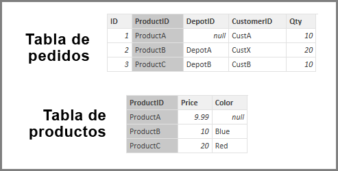
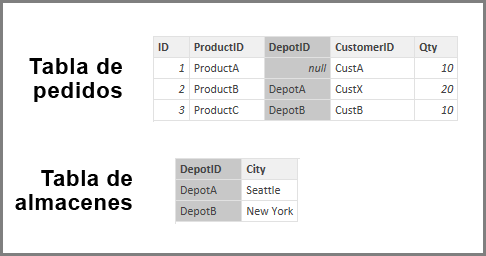
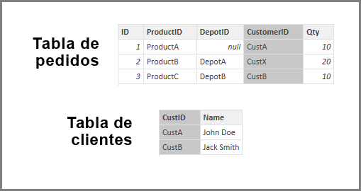

# Aplicación de la opción Asumir integridad referencial en Power BI Desktop
Al conectarse con un origen de datos mediante **DirectQuery**, puede seleccionar **Asumir integridad referencial** para habilitar la ejecución de consultas más eficientes en el origen de datos. Esta característica tiene unos cuantos requisitos de datos subyacentes y solo está disponible cuando se utiliza **DirectQuery**.

Al configurar **Asumir integridad referencial**, las consultas sobre el origen de datos pueden usar instrucciones de **COMBINACIÓN INTERNA** en lugar de las de **COMBINACIÓN EXTERNA**, lo cual mejora la eficiencia de las consultas.

## Requisitos para el uso de Asumir integridad referencial
Se trata de una opción avanzada y solo está habilitada durante la conexión a datos mediante **DirectQuery**. Para que funcione correctamente **Asumir integridad referencial** es necesario cumplir los siguientes requisitos:

* Los datos de la columna **Desde** en la relación nunca deben ser *nulos* ni estar *en blanco*
* Para cada valor de la columna **Desde**, hay un valor correspondiente en la columna **Para**

En este contexto, la columna **Desde** es *Varios* en una relación *Uno a varios* o es la columna en la primera tabla en una relación *Uno a varios*.

## Ejemplo de uso de Asumir integridad referencial
En el ejemplo siguiente se muestra cómo se comporta **Asumir integridad referencial** durante el uso en conexiones de datos. En el ejemplo se conecta a un origen de datos que incluye una tabla **Orders**, una tabla **Products** y una tabla **Depots**.

1. En la siguiente imagen que muestra la tabla **Orders** y la tabla **Products**, tenga en cuenta que existe integridad referencial entre **Orders[ProductID]** y **Products[ProductID]** . La columna **[ProductID]** en la tabla **Orders** nunca es *Null* y cada valor aparece también en la tabla **Products**. Por tanto, se debe establecer **Asumir integridad referencial** para obtener consultas más eficientes (al utilizar esta opción no cambian los valores mostrados en objetos visuales).
   
   
2. En la siguiente imagen, tenga en cuenta que no existe ninguna integridad referencial entre **Orders[DepotID]** y **Depots[DepotID]** , porque **DepotID** es *Null* para algunos *Orders*. Por tanto, **Asumir integridad referencial** no se *debe* establecer.
   
   
3. Por último, no existe ninguna integridad referencial entre **Orders[CustomerID]** y **Customers[CustID]** en las siguientes tablas; **CustomerID** contiene algunos valores (en este caso, *CustX*) que no existen en la tabla *Customers*. Por tanto, **Asumir integridad referencial** no se *debe* establecer.
   
   

## Establecer Asumir integridad referencial
Para habilitar esta característica, active la casilla junto a **Asumir integridad referencial** tal como se muestra en la imagen de abajo.

Cuando se activa, la configuración se valida con los datos para asegurarse de que no hay ninguna fila *Null* o que no coincida. *Sin embargo*, en casos con un gran número de valores, la validación no es una garantía de que no hay ningún problema de integridad referencial.

Además, la validación se produce en el momento de la edición de la relación y *no* refleja ningún cambio posterior en los datos.

## ¿Qué ocurre si se establece incorrectamente Asumir la integridad referencial?
Si establece **Asumir integridad referencial** cuando hay problemas de integridad referencial en los datos, no se producirán errores. Sin embargo, dará lugar a incoherencias evidentes en los datos. Por ejemplo, en el caso de la relación con la tabla **Depots** descrita anteriormente, el resultado sería el siguiente:

* Un objeto visual que muestra el total de *Order Qty* mostraría un valor de 40.
* Un objeto visual que muestra el total de *Order Qty by Depot City* mostraría un valor total de *30* solamente, porque no incluiría el identificador de pedido 1, donde **DepotID** es *Null*.

## Pasos siguientes
Más información sobre [DirectQuery](desktop-use-directquery.md)

Más información sobre [Relaciones en Power BI](../transform-model/desktop-create-and-manage-relationships.md)

Obtenga más información sobre [Vista de relaciones en Power BI Desktop](../transform-model/desktop-relationship-view.md).
