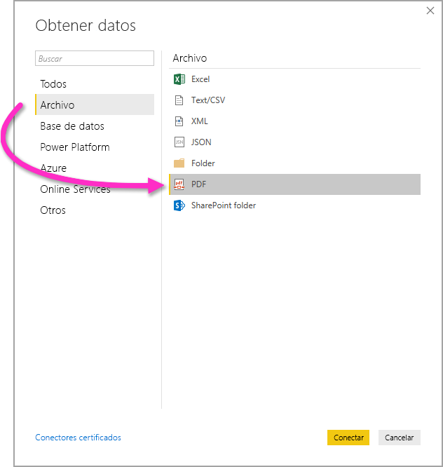

# Conectarse a archivos PDF en Power BI Desktop
En Power BI Desktop, puede conectarse a un **archivo PDF** y usar los datos incluidos del archivo, como con cualquier otro origen de datos en Power BI Desktop.

En las secciones siguientes se describe cómo conectarse a un **archivo PDF**, seleccionar datos y enviarlos a **Power BI Desktop**.

Siempre se recomienda actualizar a la versión más reciente de **Power BI Desktop**, que se puede obtener desde un vínculo en [Obtener Power BI Desktop](../fundamentals/desktop-get-the-desktop.md). 

## Conectarse a un archivo PDF
Para conectarse a un archivo **PDF**, seleccione **Get Data** (Obtener datos) en la cinta **Inicio** de Power BI Desktop. Seleccione **Archivo** en las categorías de la izquierda y verá **PDF**.

Se le pedirá que indique la ubicación del archivo PDF que quiere usar. Después de indicar la ubicación del archivo y de cargarse el archivo PDF, aparece una ventana de **Navegador**, en la que se muestran los datos disponibles del archivo, desde donde puede seleccionar uno o varios elementos para importarlos y usarlos en **Power BI Desktop**.

Al activar una casilla junto a elementos detectados en el archivo PDF, estos se muestran en el panel derecho. Cuando esté listo para importar, seleccione el botón **Cargar** para introducir los datos en **Power BI Desktop**.

A partir del lanzamiento de **Power BI Desktop** en noviembre de 2018, puede especificar la **página de inicio** y la **página de finalización** como parámetros opcionales para la conexión PDF. También puede especificar estos parámetros en el lenguaje de fórmulas M, con el formato siguiente:

`Pdf.Tables(File.Contents("c:\sample.pdf"), [StartPage=10, EndPage=11])`

## Pasos siguientes
Hay todo tipo de datos a los que puede conectarse con Power BI Desktop. Para obtener más información sobre orígenes de datos, consulte los siguientes recursos:

* [¿Qué es Power BI Desktop?](../fundamentals/desktop-what-is-desktop.md)
* [Orígenes de datos en Power BI Desktop](desktop-data-sources.md)
* [Combinar datos y darles forma con Power BI Desktop](desktop-shape-and-combine-data.md)
* [Connect to Excel workbooks in Power BI Desktop (Conectarse a libros de Excel en Power BI Desktop)](desktop-connect-excel.md)   
* [Especificar datos directamente en Power BI Desktop](desktop-enter-data-directly-into-desktop.md)   
