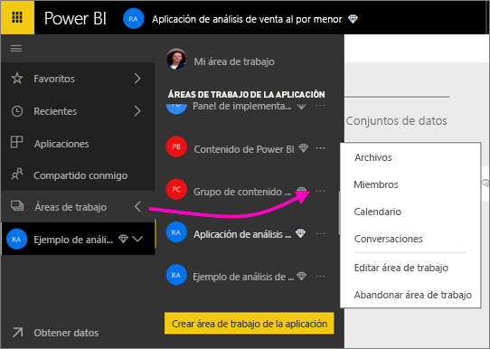
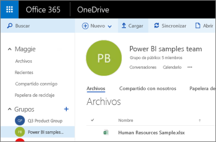
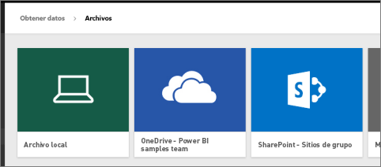
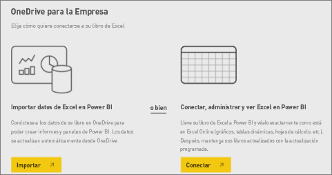
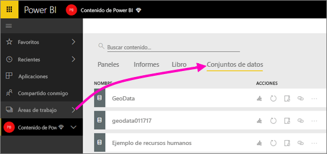
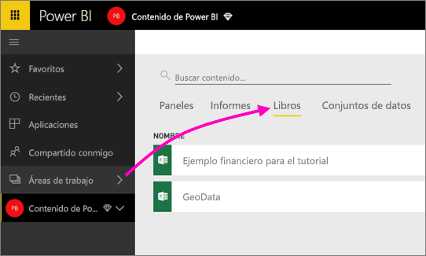

# Conexión a los archivos almacenados en OneDrive del área de trabajo de Power BI
Una vez que [haya creado un área de trabajo en Power BI](../collaborate-share/service-create-distribute-apps.md), puede almacenar los archivos de Excel, CSV y Power BI Desktop en la instancia de OneDrive para la Empresa de dicha área. Puede seguir actualizando los archivos que se almacenan en OneDrive. Esas actualizaciones se reflejan automáticamente en los informes y paneles de Power BI según los archivos. 

> [!NOTE]
> La nueva experiencia de áreas de trabajo cambiará la relación entre las áreas de trabajo de Power BI y los grupos de Microsoft 365. Ya no se crea automáticamente un grupo de Microsoft 365 cada vez que crea una de las nuevas áreas de trabajo. Lea sobre la [creación de las nuevas áreas de trabajo](../collaborate-share/service-create-the-new-workspaces.md).

La incorporación de archivos al área de trabajo es un proceso que consta de dos pasos: 

1. En primer lugar, [cargue los archivos en OneDrive para la Empresa](service-connect-to-files-in-app-workspace-onedrive-for-business.md#1-upload-files-to-the-onedrive-for-business-for-your-workspace) del área de trabajo.
2. Después, [conéctese a esos archivos desde Power BI](service-connect-to-files-in-app-workspace-onedrive-for-business.md#2-import-excel-files-as-datasets-or-as-excel-online-workbooks).

> [!NOTE]
> Las áreas de trabajo solo están disponibles en [Power BI Pro](../fundamentals/service-features-license-type.md).
> 

## 1 Cargue los archivos en OneDrive para la Empresa del área de trabajo
1. En el servicio Power BI, seleccione la flecha situada junto a Áreas de trabajo y, después, el botón de puntos suspensivos ( **...** ) junto al nombre del área de trabajo. 
   
   
2. Seleccione **Archivos** para abrir OneDrive para la Empresa del área de trabajo en Microsoft 365.
   
   > [!NOTE]
   > Si no ve **Archivos** en el área de trabajo, seleccione **Miembros** para abrir OneDrive para la Empresa del área de trabajo. Una vez ahí, seleccione **Archivos**. Microsoft 365 configura una ubicación de almacenamiento en OneDrive para los archivos del área de trabajo de su aplicación. Este proceso puede tardar algún tiempo.
   > 
   > 
3. Aquí puede cargar los archivos en OneDrive para la Empresa del área de trabajo. Seleccione **Cargar**y vaya a los archivos.
   
   

## 2 Importación de archivos de Excel como conjuntos de datos o como libros de Excel Online
Ahora que los archivos se encuentran en OneDrive para la Empresa del área de trabajo, tiene dos opciones. Puede: 

* [Importar los datos desde el libro de Excel como un conjunto de datos](service-get-data-from-files.md). Usar luego los datos para crear informes y paneles que se puedan ver en un explorador web y en dispositivos móviles.
* O bien, [conectarse a un libro de Excel completo en Power BI](service-excel-workbook-files.md) y mostrarlo exactamente como aparece en Excel Online.

### Importación o conexión de los archivos del área de trabajo
1. En Power BI, cambie al área de trabajo para que su nombre aparezca en la esquina superior izquierda. 
2. Seleccione **Obtener datos** en la parte inferior del panel de navegación. 
   
   
3. En el cuadro **Archivos** , seleccione **Obtener**.
   
   
4. Seleccione **OneDrive** - *Nombre del área de trabajo*.
   
    
5. Seleccione el archivo que quiera > **Conectar**.
   
    En este punto, debe decidir si [importar los datos desde el libro de Excel](service-get-data-from-files.md) o [conectarse a los libros de Excel completos](service-excel-workbook-files.md).
6. Seleccione **Importar** o **Conectarse**.
   
    
7. Si selecciona **Importar**, el libro aparecerá en la pestaña **Conjuntos de datos**. 
   
    
   
    Si selecciona **Conectar**, el libro aparecerá en la pestaña **Libros**.
   
    

## Pasos siguientes
* [Creación de aplicaciones y áreas de trabajo en Power BI](../collaborate-share/service-create-distribute-apps.md)
* [Importar datos desde libros de Excel](service-get-data-from-files.md)
* [Conectarse a libros de Excel completos](service-excel-workbook-files.md)
* ¿Tiene más preguntas? [Pruebe la comunidad de Power BI](https://community.powerbi.com/)
* Comentarios Visite [Ideas sobre Power BI](https://ideas.powerbi.com/forums/265200-power-bi)
