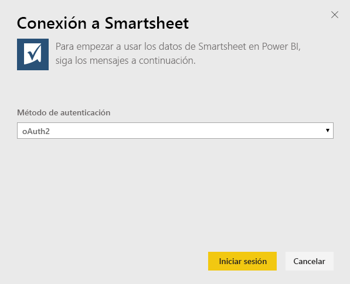
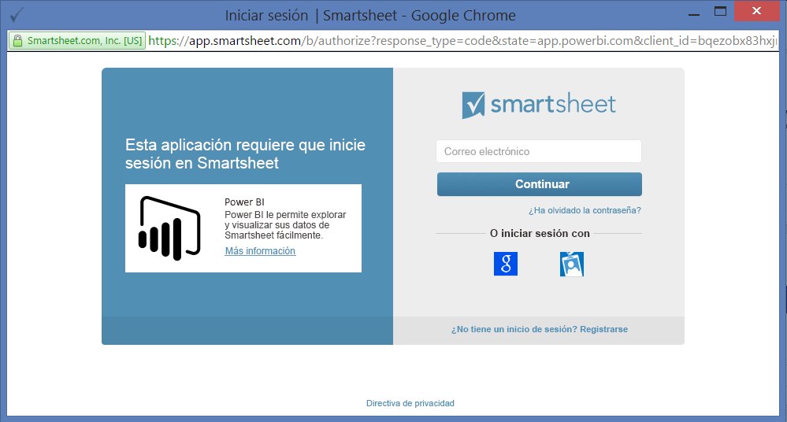
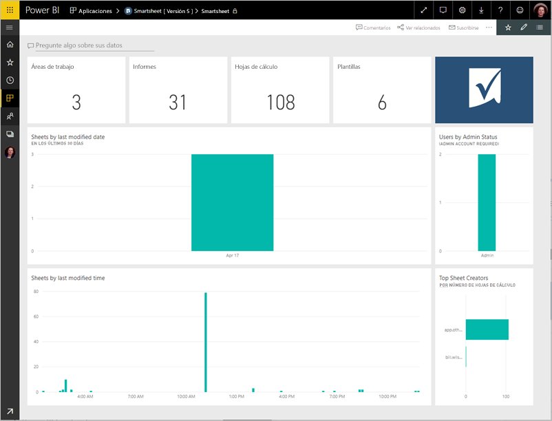
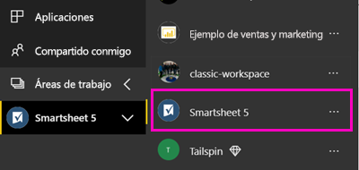
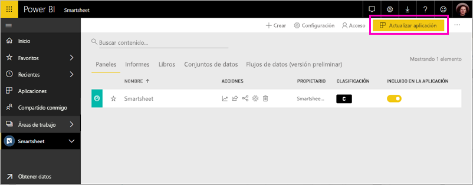

# Conexión a Smartsheet con Power BI
En este artículo, se explica cómo obtener datos de una cuenta de Smartsheet con una aplicación de plantilla de Power BI. Smartsheet ofrece una plataforma sencilla para la colaboración y el uso compartido de archivos. La aplicación de plantilla de Smartsheet para Power BI proporciona un panel, informes y un conjunto de datos que presenta una visión general de la cuenta de Smartsheet. También puede usar [Power BI Desktop](desktop-connect-to-data.md) para conectarse directamente a hojas individuales en su cuenta. 

Después de instalar la aplicación de plantilla, puede cambiar el panel y el informe. A continuación, puede distribuirlo como una aplicación entre los compañeros de su organización.

Conéctese a la [aplicación de plantilla de Smartsheet](https://app.powerbi.com/groups/me/getapps/services/pbi-contentpacks.pbiapps-smartsheet) para Power BI.

>[!NOTE]
>Es preferible usar una cuenta de administrador de Smartsheet para conectarse a la aplicación de plantilla Power BI y cargarla, ya que tiene acceso adicional.

## Cómo conectarse

[!INCLUDE [powerbi-service-apps-get-more-apps](../includes/powerbi-service-apps-get-more-apps.md)]

3. Seleccione **Smartsheet** \> **Obtener**.
4. En **¿Instalar esta aplicación de Power BI?** , seleccione **Instalar**.
4. En el panel **Aplicaciones**, seleccione el icono de **Smartsheet**.

    

6. En **Empezar a trabajar con la nueva aplicación**, seleccione **Conectar**.

    

4. En Método de autenticación, seleccione **oAuth2 \> Iniciar sesión**.
   
   Cuando se le solicite, escriba las credenciales de Smartsheet y siga el proceso de autenticación.
   
   
   
   

5. Después de que Power BI importe los datos, se abre el panel de Smartsheet.
   
   

## Modificar y distribuir una aplicación

Ha instalado la aplicación de plantilla de Smartsheet. Esto significa que también ha creado el área de trabajo de la aplicación de Smartsheet. En el área de trabajo, puede cambiar el informe y el panel y, después, distribuirlo como una *aplicación* a los compañeros de su organización. 

1. Para ver todo el contenido del nuevo área de trabajo de Smartsheet, en el panel de navegación, seleccione **Áreas de trabajo** > **Smartsheet**. 

    

    Esta vista es la lista de contenidos del área de trabajo. En la esquina superior derecha, verá **Actualizar aplicación**. Aquí empezará cuando esté preparado para distribuir la aplicación a sus compañeros. 

    

2. Seleccione **Informes** y **Conjuntos de datos** para ver el resto de los elementos del área de trabajo.

    Obtenga información sobre cómo [distribuir aplicaciones](../collaborate-share/service-create-distribute-apps.md) a sus compañeros.

## Qué se incluye
La aplicación de plantilla de Smartsheet para Power BI incluye información general de la cuenta de Smartsheet, como el número de áreas de trabajo, informes y hojas que tiene, cuándo se modifican, etc. Los usuarios administradores también ven información sobre los usuarios en su sistema, como los creadores de hojas más destacados.  

Para conectarse directamente a hojas individuales de su cuenta, puede usar el conector de Smartsheet en [Power BI Desktop](desktop-connect-to-data.md).  

## Pasos siguientes

* [Crear las nuevas áreas de trabajo en Power BI](../collaborate-share/service-create-the-new-workspaces.md)
* [Instalar y usar aplicaciones en Power BI](../consumer/end-user-apps.md)
* [Conectarse a aplicaciones de Power BI para servicios externos](service-connect-to-services.md)
* ¿Tiene alguna pregunta? [Pruebe a preguntar a la comunidad de Power BI](https://community.powerbi.com/)