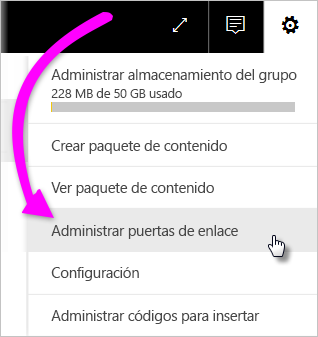
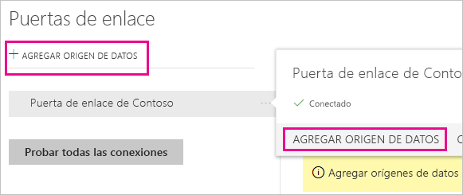
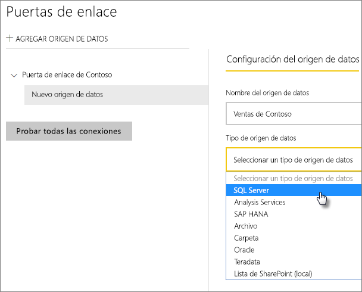
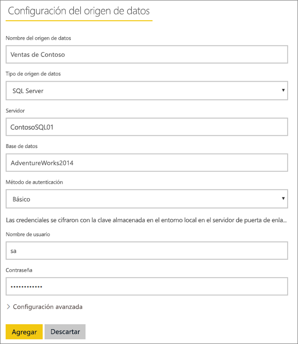
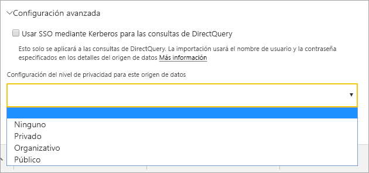
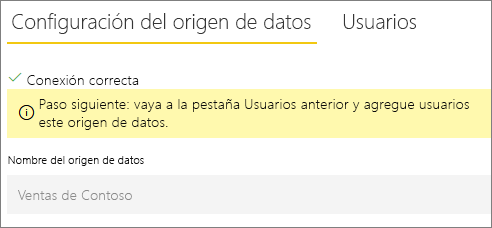
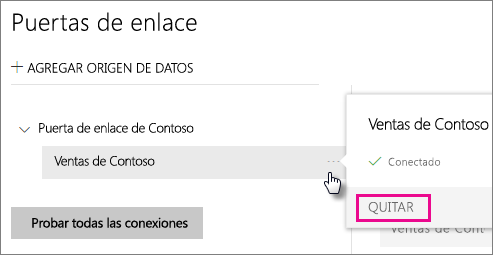
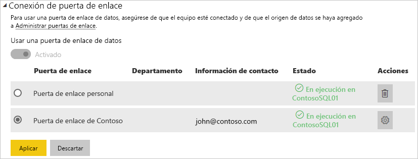
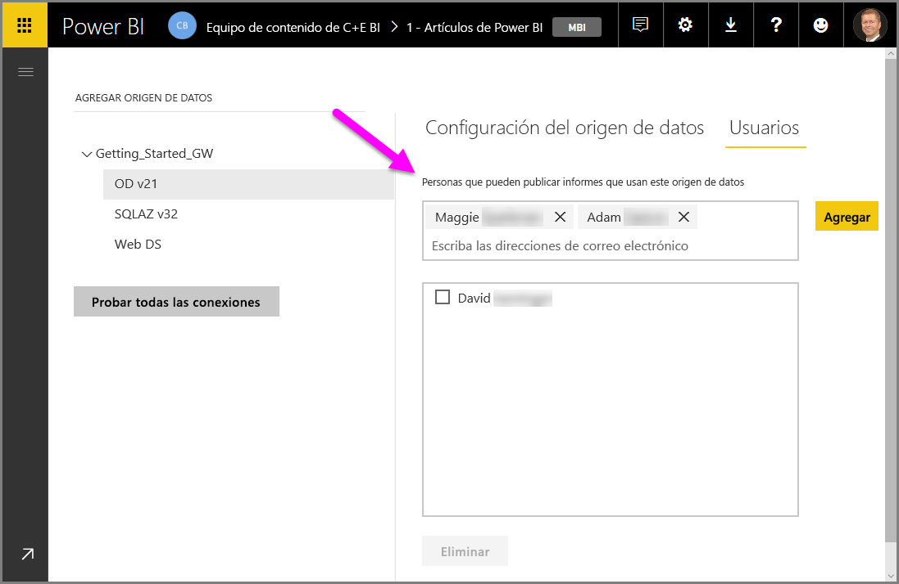
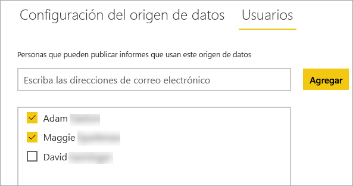

# Administración de orígenes de datos

[!INCLUDE [gateway-rewrite](../includes/gateway-rewrite.md)]

Power BI admite muchos [orígenes de datos locales](power-bi-data-sources.md), cada uno con sus propios requisitos. Una puerta de enlace se puede usar para un único origen de datos, o bien para varios. En este ejemplo, se muestra cómo agregar SQL Server como un origen de datos. Los pasos son similares para otros orígenes de datos.

La mayoría de las operaciones de administración de los orígenes de datos también se pueden realizar mediante API. Para más información, vea [API REST (puertas de enlace)](/rest/api/power-bi/gateways).

## Agregar un origen de datos

1. En la esquina superior derecha del servicio Power BI, seleccione el icono del engranaje  > **Administrar puertas de enlace**.

    

2. Seleccione una puerta de enlace y, después, **Agregar origen de datos**. O bien, vaya a **Puertas de enlace** > **Agregar origen de datos**.

    

3. Seleccione el **tipo de origen de datos**.

    

4. Escriba la información del origen de datos. En este ejemplo, es **Servidor**, **Base de datos** y otra información. 

    

5. Para SQL Server, elija un **Método de autenticación** de **Windows** o **Básico** (Autenticación de SQL). Si elige **Básico**, escriba las credenciales del origen de datos.

6. En **Configuración avanzada**, puede configurar el [inicio de sesión único (SSO)](service-gateway-sso-overview.md) del origen de datos. 

    

Se puede configurar **Usar un SSO mediante Kerberos en las consultas de DirectQuery** o **Uso de SSO mediante Kerberos en consultas de importación y DirectQuery** para los informes basados en DirectQuery, y **Uso de SSO mediante Kerberos en consultas de importación y DirectQuery** para los informes basados en actualizaciones.

Si activa **Usar un SSO mediante Kerberos en las consultas de DirectQuery** y usa este origen de datos en un informe basado en DirectQuery, se usará el usuario que esté asignado al usuario de (Azure) Active Directory que inicie sesión en el servicio Power BI. En el caso de un informe basado en actualización, se usarán las credenciales que especificó en los campos **Nombre de usuario** y **Contraseña**.

Si activa **Uso de SSO mediante Kerberos en consultas de importación y DirectQuery**, no es necesario proporcionar ninguna credencial. Si este origen de datos se usa en un informe basado en DirectQuery, se usará el usuario que esté asignado al usuario de (Azure) Active Directory que inicie sesión en el servicio Power BI.  En el caso de un informe basado en actualización, se usará el contexto de seguridad del propietario del conjunto de datos.

> [!NOTE]
>SSO para las consultas de importación solo está disponible para la lista de orígenes de datos de SSO que usan la [delegación restringida de Kerberos](service-gateway-sso-kerberos.md).

7. En **Configuración avanzada**, si quiere puede configurar el [nivel de privacidad](https://support.office.com/article/Privacy-levels-Power-Query-CC3EDE4D-359E-4B28-BC72-9BEE7900B540) del origen de datos (no se aplica a [DirectQuery](desktop-directquery-about.md)).

    

8. Seleccione **Agregar**. Si el proceso se completa correctamente, verá el mensaje *Conexión correcta*.

    

Ahora puede usar este origen de datos para incluir los datos de SQL Server en los informes y paneles de Power BI.

## Quitar un origen de datos

Puede quitar un origen de datos si ya no lo usa. Si quita un origen de datos, se interrumpirá cualquier panel e informe que se base en dicho origen.

Para quitar un origen de datos, vaya al origen de datos y luego seleccione **Quitar**.

## Uso del origen de datos para actualización programada o DirectQuery

Después de haber creado el origen de datos, estará disponible para usarse con conexiones DirectQuery, o bien a través de una actualización programada.

> [!NOTE]
>El nombre del servidor y de la base de datos deben coincidir entre Power BI Desktop y el origen de datos dentro de la puerta de enlace de datos local.

El vínculo entre el conjunto de datos y el origen de datos de la puerta de enlace se basa en el nombre del servidor y el de la base de datos. Estos nombres deben coincidir. Por ejemplo, si proporciona una dirección IP para el nombre del servidor, en Power BI Desktop, tendrá que usar la dirección IP del origen de datos de la configuración de la puerta de enlace. Si usa *SERVIDOR\INSTANCIA* en Power BI Desktop, tendrá que usar lo mismo en el origen de datos configurado para la puerta de enlace.

Si aparece en la pestaña **Usuarios** del origen de datos configurado en la puerta de enlace y los nombres del servidor y de la base de datos coinciden, verá la puerta de enlace como una opción para usar con la actualización programada.

> [!WARNING]
> Si el conjunto de datos contiene varios orígenes de datos, deberá agregar cada uno en la puerta de enlace. Si no se agregan uno o varios orígenes de datos a la puerta de enlace, no la verá como disponible para la actualización programada.

### Limitaciones

OAuth es un esquema de autenticación compatible solo para conectores personalizados con la puerta de enlace de datos local. No puede agregar otros orígenes de datos que requieran OAuth. Si el conjunto de datos tiene un origen de datos que requiere OAuth que no es un conector personalizado, no podrá usar la puerta de enlace para la actualización programada.

## Administrar usuarios

Después de agregar un origen de datos a una puerta de enlace, conceda acceso a los usuarios y grupos de seguridad habilitados para correo electrónico al origen de datos específico (no a toda la puerta de enlace). La lista de usuarios del origen de datos controla solo a quién se le permite publicar informes que incluyen datos del origen de datos. Los propietarios de informes pueden crear paneles, paquetes de contenido y aplicaciones y compartir esos elementos con otros usuarios.

También puede conceder acceso administrativo a los usuarios y grupos de seguridad a la puerta de enlace.

### Adición de usuarios a un origen de datos

1. En la esquina superior derecha del servicio Power BI, seleccione el icono del engranaje  > **Administrar puertas de enlace**.

2. Seleccione el origen de datos en el que desea agregar usuarios.

3. Seleccione **Usuarios** y especifique un usuario de su organización a quien desea conceder acceso al origen de datos seleccionado. Por ejemplo, en la pantalla siguiente, se agrega a Maggie y a Adam.

    

4. Seleccione **Agregar**, y el nombre del miembro agregado se muestra en el cuadro.

    

Recuerde que debe agregar usuarios a cada origen de datos al que quiera conceder acceso. Cada origen de datos tiene una lista independiente de usuarios. Agregue usuarios a cada origen de datos por separado.

### Eliminación de usuarios de un origen de datos

En la pestaña **Usuarios** del origen de datos, puede quitar usuarios y grupos de seguridad que usan este origen de datos.

## Almacenamiento de credenciales cifradas en la nube

Cuando agrega un origen de datos a la puerta de enlace, debe proporcionar las credenciales de ese origen de datos. Todas las consultas que se realicen al origen de datos se ejecutarán con estas credenciales. Las credenciales se cifran de forma segura. Usan el cifrado simétrico para que no se puedan descifrar en la nube, antes de almacenarse en ella. Las credenciales se envían al equipo en el que se ejecuta la puerta de enlace, de forma local, donde se descifran cuando se accede a los orígenes de datos.

## Lista de tipos de orígenes de datos disponibles

Para obtener información sobre los orígenes de datos que admite la puerta de enlace de datos local, vea [Orígenes de datos de Power BI ](power-bi-data-sources.md).

## Pasos siguientes

* [Administrar el origen de datos: Analysis Services](service-gateway-enterprise-manage-ssas.md)
* [Administrar el origen de datos: SAP HANA](service-gateway-enterprise-manage-sap.md)
* [Administrar el origen de datos: SQL Server](service-gateway-enterprise-manage-sql.md)
* [Administrar el origen de datos: Oracle](service-gateway-onprem-manage-oracle.md)
* [Administrar el origen de datos: importación o actualización programada](service-gateway-enterprise-manage-scheduled-refresh.md)
* [Instrucciones para implementar una puerta de enlace de datos](service-gateway-deployment-guidance.md)

¿Tiene más preguntas? Consulte la [Comunidad de Power BI](https://community.powerbi.com/).
