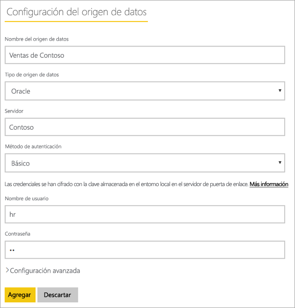
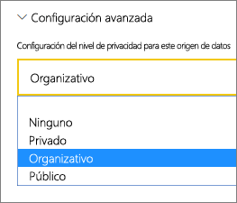
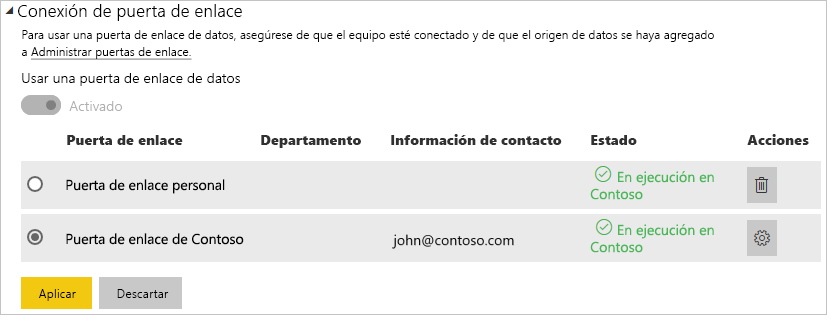

# <a name="manage-your-data-source---oracle"></a>Administrar el origen de datos: Oracle

[!INCLUDE [gateway-rewrite](../includes/gateway-rewrite.md)]

Después de [instalar la puerta de enlace de datos local](/data-integration/gateway/service-gateway-install), tendrá que [agregar orígenes de datos](service-gateway-data-sources.md#add-a-data-source) que se puedan usar con ella. En este artículo se describe cómo trabajar con puertas de enlace y orígenes de datos de Oracle para la actualización programada o para DirectQuery.

## <a name="install-the-oracle-client"></a>Instalación del cliente de Oracle

Para conectar la puerta de enlace al servidor de Oracle, el proveedor de datos de Oracle para .NET (ODP.NET) ha de estar instalado y configurado. ODP.NET forma parte de Oracle Data Access Components (ODAC).

En el caso de las versiones de 32 bits de Power BI Desktop, use el vínculo siguiente para descargar e instalar el cliente de 32 bits de Oracle:

* [Oracle Data Access Components (ODAC) de 32 bits con Oracle Developer Tools para Visual Studio (12.1.0.2.4)](https://www.oracle.com/technetwork/topics/dotnet/utilsoft-086879.html)

En el caso de las versiones de 64 bits de Power BI Desktop o de la puerta de enlace de datos local, use el siguiente vínculo para descargar e instalar el cliente de Oracle de 64 bits:

* [ODAC 12.2c versión 1 (12.2.0.1.0) de 64 bits para Windows x64](https://www.oracle.com/technetwork/database/windows/downloads/index-090165.html)

Después de instalar el cliente, configure el archivo tnsnames.ora con la información adecuada para la base de datos. Power BI Desktop y la puerta de enlace se activan mediante el parámetro net_service_name definido en el archivo tnsnames.ora. Si net_service_name no está configurado, no podrá conectarse. La ruta de acceso predeterminada para tnsnames.ora es `[Oracle Home Directory]\Network\Admin\tnsnames.ora`. Para obtener más información sobre cómo configurar los archivos tnsnames.ora, consulte [Oracle: Parámetros de nomenclatura local (tnsnames.ora)](https://docs.oracle.com/cd/B28359_01/network.111/b28317/tnsnames.htm).

### <a name="example-tnsnamesora-file-entry"></a>Ejemplo de entrada de archivo tnsnames.ora

Este es el formato básico de una entrada en tnsname.ora:

```
net_service_name=
 (DESCRIPTION=
   (ADDRESS=(protocol_address_information))
   (CONNECT_DATA=
     (SERVICE_NAME=service_name)))
```

Aquí tiene un ejemplo que incluye la información del servidor y el puerto:

```
CONTOSO =
  (DESCRIPTION =
    (ADDRESS = (PROTOCOL = TCP)(HOST = oracleserver.contoso.com)(PORT = 1521))
    (CONNECT_DATA =
      (SERVER = DEDICATED)
      (SERVICE_NAME = CONTOSO)
    )
  )
```

## <a name="add-a-data-source"></a>Elegir un origen de datos

Para más información sobre cómo agregar un origen de datos, consulte [Adición de un origen de datos](service-gateway-data-sources.md#add-a-data-source). Como **Tipo de origen de datos**, seleccione **Oracle**.


Cuando haya seleccionado el tipo de origen de datos Oracle, rellene su información, que incluye **Servidor** y **Base de datos**. 

Como **Método de autenticación** puede elegir **Windows** o **Básico**. Si va a usar una cuenta creada en Oracle, elija **Básico** en lugar de Windows. A continuación, escriba las credenciales que se van a usar con este origen de datos.

> [!NOTE]
> Todas las consultas que se realicen al origen de datos se ejecutarán con estas credenciales. Para más información sobre cómo se almacenan las credenciales, vea [Almacenamiento de credenciales cifradas en la nube](service-gateway-data-sources.md#store-encrypted-credentials-in-the-cloud).



Después de rellenar todo, seleccione **Agregar**. Ahora puede usar este origen de datos para la actualización programada o para DirectQuery en un servidor de Oracle local. Si se realiza correctamente, verá el mensaje *Se conectó correctamente*.


### <a name="advanced-settings"></a>Configuración avanzada

Opcionalmente, puede configurar el nivel de privacidad del origen de datos. Esta configuración controla cómo se pueden combinar los datos. Solo se usa para la actualización programada. La configuración del nivel de privacidad no se aplica a DirectQuery. Para más información sobre los niveles de privacidad del origen de datos, vea [Niveles de privacidad (Power Query)](https://support.office.com/article/Privacy-levels-Power-Query-CC3EDE4D-359E-4B28-BC72-9BEE7900B540).



## <a name="use-the-data-source"></a>Uso del origen de datos

Después de haber creado el origen de datos, estará disponible para usarse con conexiones DirectQuery, o bien a través de una actualización programada.

> [!WARNING]
> El nombre del servidor y de la base de datos deben coincidir entre Power BI Desktop y el origen de datos dentro de la puerta de enlace de datos local.

El vínculo entre el conjunto de datos y el origen de datos dentro de la puerta de enlace se basa en el nombre del servidor y en el nombre de la base de datos. Estos nombres deben coincidir. Por ejemplo, si proporciona una dirección IP para el nombre del servidor, dentro de Power BI Desktop, tendrá que usar la dirección IP del origen de datos dentro de la configuración de la puerta de enlace. Este nombre también tiene que coincidir con un alias definido en el archivo tnsnames.ora. Para obtener más información sobre el archivo tnsnames.ora, vea [Instalación del cliente de Oracle](#install-the-oracle-client).

Este requisito se aplica tanto a DirectQuery como a la actualización programada.

### <a name="use-the-data-source-with-directquery-connections"></a>Uso del origen de datos con conexiones de DirectQuery

Asegúrese de que el nombre del servidor y de la base de datos coinciden entre Power BI Desktop y el origen de datos configurado para la puerta de enlace. También tiene que asegurarse de que el usuario aparece en la pestaña **Usuarios** del origen de datos para publicar conjuntos de datos de DirectQuery. La selección para DirectQuery se produce dentro de Power BI Desktop al importar los datos por primera vez. Para obtener más información sobre cómo usar DirectQuery, vea el artículo sobre el [uso de DirectQuery en Power BI Desktop](desktop-use-directquery.md).

Después de publicar, ya sea desde Power BI Desktop o desde **Obtener datos**, los informes deben empezar a funcionar. La conexión puede tardar varios minutos en poderse usar después de crear el origen de datos dentro de la puerta de enlace.

### <a name="use-the-data-source-with-scheduled-refresh"></a>Uso del origen de datos con la actualización programada

Si aparece en la pestaña **Usuarios** del origen de datos configurado dentro de la puerta de enlace y los nombres del servidor y de la base de datos coinciden, verá la puerta de enlace como una opción para usar con la actualización programada.



## <a name="troubleshooting"></a>Solución de problemas

Es posible que se produzcan varios errores en Oracle si la sintaxis de los nombres no es correcta o no está configurada correctamente:

* ORA-12154: TNS:no se ha podido resolver el identificador de conexión especificado.
* ORA-12514: TNS:el listener no conoce actualmente el servicio solicitado en el descriptor de conexión.
* ORA-12541: TNS:no hay ningún listener.
* ORA-12170: TNS:error de tiempo de espera de conexión.
* ORA-12504: TNS:el listener no ha recibido el SERVICE_NAME en CONNECT_DATA.

Estos errores podrían producirse si el cliente de Oracle no está instalado o no se ha configurado correctamente. Si está instalado, compruebe que el archivo tnsnames.ora esté configurado correctamente y que usa el parámetro net_service_name adecuado. También tendrá que asegurarse de que net_service_name sea el mismo en la máquina en donde se usa Power BI Desktop y la que ejecuta la puerta de enlace. Para obtener más información, vea [Instalación del cliente de Oracle](#install-the-oracle-client).

> [!NOTE]
> También podría encontrar un problema de compatibilidad entre la versión del servidor y la del cliente de Oracle. Normalmente, las versiones deberían coincidir.

Para obtener más información sobre la solución de problemas relacionados con la puerta de enlace, vea [Solución de problemas con la puerta de enlace de datos local](/data-integration/gateway/service-gateway-tshoot).

## <a name="next-steps"></a>Pasos siguientes

* [Solución de problemas de puertas de enlace: Power BI](service-gateway-onprem-tshoot.md)
* [Power BI Premium](../admin/service-premium-what-is.md)

¿Tiene más preguntas? Pruebe a preguntar a la [comunidad de Power BI](https://community.powerbi.com/).
