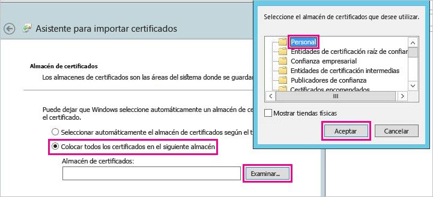
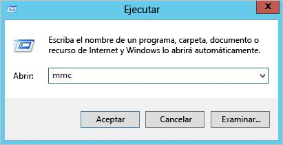

# <a name="use-security-assertion-markup-language-saml-for-sso-from-power-bi-to-on-premises-data-sources"></a>Uso de SAML (Lenguaje de marcado de aserción de seguridad) para el SSO de Power BI en orígenes de datos locales

La habilitación de SSO facilita la tarea de los informes y paneles de Power BI de actualizar los datos de orígenes locales al tiempo que se respetan los permisos de nivel de usuario configurados en esos orígenes. Use [SAML (Lenguaje de marcado de aserción de seguridad)](https://www.onelogin.com/pages/saml) para habilitar la conectividad de inicio de sesión único directa. 

## <a name="supported-data-sources"></a>Orígenes de datos admitidos

Actualmente se admite SAP HANA con SAML. Para más información acerca de cómo instalar y configurar el inicio de sesión único para SAP HANA con SAML, consulte [SSO de SAML para la plataforma de BI a HANA](https://wiki.scn.sap.com/wiki/display/SAPHANA/SAML+SSO+for+BI+Platform+to+HANA).

Se admiten orígenes de datos adicionales con [Kerberos](service-gateway-sso-kerberos.md) (incluido SAP HANA).

Para SAP HANA, se recomienda habilitar el cifrado antes de establecer una conexión de inicio de sesión único con SAML. Para habilitar el cifrado, configure el servidor de HANA para que acepte las conexiones cifradas y configure la puerta de enlace para que use el cifrado para comunicarse con el servidor de HANA. Como el controlador ODBC de HANA no cifra las aserciones de SAML de forma predeterminada, la aserción de SAML firmada se envía desde la puerta de enlace al servidor de HANA *sin cifrar* y es vulnerable a la intercepción y reutilización por parte de terceros. Consulte [Habilitación del cifrado para SAP HANA](/power-bi/desktop-sap-hana-encryption) para instrucciones sobre cómo habilitar el cifrado para HANA con la biblioteca de OpenSSL.

## <a name="configuring-the-gateway-and-data-source"></a>Configuración del origen de datos y la puerta de enlace

Para usar SAML, debe establecer una relación de confianza entre los servidores de HANA para los que quiere habilitar el inicio de sesión único y la puerta de enlace, que actúa como proveedor de identidades de SAML (IdP) en este escenario. Hay varias maneras de establecer esta relación, como importar el certificado x509 del IdP de la puerta de enlace en el almacén de confianza de los servidores de HANA, o bien, hacer que una entidad de certificación (CA) raíz de confianza para los servidores HANA firme el certificado X509 de la puerta de enlace. Aunque el primer método se explica en esta guía, puede usar otro si le resulta más cómodo.

A pesar de que en esta guía se usa OpenSSL como proveedor de servicios criptográficos del servidor de HANA, SAP recomienda el uso de la biblioteca de cifrado de SAP (también conocida como CommonCryptoLib o sapcrypto), en lugar de OpenSSL, para realizar los pasos de configuración donde se establece la relación de confianza. Para más información, consulte la documentación oficial de SAP.

En los pasos siguientes se explica cómo establecer una relación de confianza entre un servidor HANA y el IdP de la puerta de enlace mediante la firma del certificado X509 del IdP de la puerta de enlace con una entidad de certificación raíz de confianza para el servidor de HANA. Creará esta entidad de certificación raíz:

1. Cree el certificado X509 de la CA raíz y la clave privada. Por ejemplo, para crear el certificado X509 de la CA raíz y la clave privada en formato .pem, escriba este comando:

   ```
   openssl req -new -x509 -newkey rsa:2048 -days 3650 -sha256 -keyout CA_Key.pem -out CA_Cert.pem -extensions v3_ca
   ```

    Asegúrese de que la clave privada de la entidad de certificación raíz esté protegida correctamente. Si la obtiene un tercero, la podría usar para acceder sin autorización al servidor de HANA. 

 1. Agregue el certificado (por ejemplo, CA_Cert.pem) al almacén de confianza del servidor de HANA para que este confíe en los certificados firmados por la entidad de certificación raíz que ha creado. 

    Encontrará la ubicación del almacén de confianza del servidor de HANA al examinar la opción de configuración **ssltruststore**. Si ha seguido las instrucciones de la documentación de SAP que tratan de cómo configurar OpenSSL, es posible que el servidor de HANA ya confíe en una entidad de certificación raíz que pueda reutilizar. Para más información, consulte [Procedimientos para configurar Open SSL para SAP HANA Studio en un servidor de SAP HANA](https://archive.sap.com/documents/docs/DOC-39571). Si tiene varios servidores de HANA para los que quiera habilitar el inicio de sesión único con SAML, asegúrese de que todos ellos confíen en esta entidad de certificación raíz.

1. Cree el certificado X509 del IdP de la puerta de enlace. 

   Por ejemplo, para crear una solicitud de firma de certificado (IdP_Req.pem) y una clave privada (IdP_Key.pem) que sean válidos durante un año, ejecute el siguiente comando:

   ```
   openssl req -newkey rsa:2048 -days 365 -sha256 -keyout IdP_Key.pem -out IdP_Req.pem -nodes
   ```

 1. Firme la solicitud de firma de certificado mediante la entidad de certificación raíz en la que confían los servidores de HANA. 

    Por ejemplo, para firmar IdP_Req.pem mediante CA_Cert.pem y CA_Key.pem (el certificado y la clave de la CA raíz), ejecute el siguiente comando:

    ```
    openssl x509 -req -days 365 -in IdP_Req.pem -sha256 -extensions usr_cert -CA CA_Cert.pem -CAkey CA_Key.pem -CAcreateserial -out IdP_Cert.pem
    ```

     El certificado de IdP resultante es válido durante un año (consulte la opción de días). 

Importe el certificado de IdP en HANA Studio para crear un nuevo proveedor de identidades de SAML:

1. En SAP HANA Studio, haga clic con el botón derecho en el nombre del servidor de SAP HANA y vaya a **Security** &gt; **Open Security Console** &gt; **SAML Identity Provider** &gt; **OpenSSL Cryptographic Library** (Seguridad > Abrir consola de seguridad > Proveedor de identidades de SAML > Biblioteca de cifrado OpenSSL).

    

1. Seleccione **Importar**, vaya a IdP_Cert.pem e impórtelo.

1. En SAP HANA Studio, seleccione la carpeta **Seguridad**.

    

1. Expanda **Usuarios** y seleccione el usuario al cual quiere asignar su usuario de Power BI.

1. Seleccione **SAML** y **Configure** (Configurar).

    

1. Seleccione el proveedor de identidades que creó en el paso 2. En **External Identity** (Identidad externa), escriba el UPN del usuario de Power BI (normalmente, la dirección de correo electrónico con la que el usuario inicia sesión en Power BI) y seleccione **Add** (Agregar). Si ha configurado la puerta de enlace para que use la opción de configuración *ADUserNameReplacementProperty*, deberá escribir el valor que reemplazará el UPN original del usuario de Power BI. 

   Por ejemplo, si ha establecido *ADUserNameReplacementProperty* en **SAMAccountName**, tendrá que escribir el valor **SAMAccountName** del usuario.

    

Ahora que ha configurado el certificado y la identidad de la puerta de enlace, convierta el certificado a formato .pfx y configure la puerta de enlace para usarlo:

1. Para convertir el certificado al formato pfx, ejecute el comando siguiente. Este comando asigna el nombre samlcert.pfx al archivo .pfx resultante y establece *root* como contraseña:

    ```
    openssl pkcs12 -export -out samltest.pfx -in IdP_Cert.pem -inkey IdP_Key.pem -passin pass:root -passout pass:root
    ```

1. Copie el archivo pfx en el equipo de puerta de enlace:

    1. Haga doble clic en samltest.pfx y, después, seleccione **Equipo local** &gt; **Siguiente**.

    1. Escriba la contraseña y, a continuación, seleccione **Siguiente**.

    1. Seleccione **Colocar todos los certificados en el siguiente almacén** y, después, **Examinar** &gt; **Personal** &gt; **Aceptar**.

    1. Seleccione **Next** (Siguiente) y **Finish** (Finalizar).

       

1. Conceda a la cuenta de servicio de la puerta de enlace acceso a la clave privada del certificado:

    1. En el equipo de puerta de enlace, ejecute Microsoft Management Console (MMC).

        

    1. En **File** (Archivo), seleccione **Add/Remove Snap-in** (Agregar o quitar complemento).

        

    1. Seleccione **Certificados** &gt; **Agregar** y, después, **Cuenta de equipo** &gt; **Siguiente**.

    1. Seleccione **Equipo local** &gt; **Finalizar** &gt; **Aceptar**.

    1. Expanda **Certificados** &gt; **Personal** &gt; **Certificados** y busque el certificado.

    1. Haga clic con el botón derecho en el certificado y vaya a **Todas las tareas** &gt; **Administrar claves privadas**.

        

    1. Agregue la cuenta de servicio de la puerta de enlace a la lista. De forma predeterminada, la cuenta es **NT SERVICE\PBIEgwService**. Puede averiguar qué cuenta ejecuta el servicio de puerta de enlace si ejecuta **services.msc** y busca el **Servicio de puerta de enlace de datos local**.

        

Por último, siga estos pasos para agregar la huella digital del certificado a la configuración de puerta de enlace:

1. Ejecute el siguiente comando de PowerShell para enumerar los certificados en la máquina:

    ```powershell
    Get-ChildItem -path cert:\LocalMachine\My
    ```

1. Copie la huella digital del certificado que ha creado.

1. Vaya al directorio de la puerta de enlace que de manera predeterminada es C:\Archivos de programa\Puerta de enlace de datos local.

1. Abra PowerBI.DataMovement.Pipeline.GatewayCore.dll.config y busque la sección *SapHanaSAMLCertThumbprint*. Pegue la huella digital que ha copiado.

1. Reinicie el servicio de puerta de enlace.

## <a name="running-a-power-bi-report"></a>Ejecución de un informe de Power BI

Ahora puede usar la página **Administrar puertas de enlace** de Power BI para configurar el origen de datos de SAP HANA y habilitar el inicio de sesión único en **Configuración avanzada**. Hacer esto le permitirá publicar los enlaces de los conjuntos de datos y los informes al origen de datos.

   

## <a name="troubleshooting"></a>Solución de problemas

Después de configurar el inicio de sesión único basado en SAML, es posible que vea el siguiente error en el portal de Power BI: *The credentials provided cannot be used for the SapHana source.* (Las credenciales proporcionadas no se pueden usar para el origen de SapHana). Este error indica que SAP HANA ha rechazado la credencial SAML.

Los seguimientos de autenticación del lado servidor proporcionan información detallada para solucionar problemas de credenciales en SAP HANA. Siga estos pasos para configurar el seguimiento para su servidor de SAP HANA:

1. En el servidor de SAP HANA, ejecute la siguiente consulta para activar el seguimiento de la autenticación:

    ```
    ALTER SYSTEM ALTER CONFIGURATION ('indexserver.ini', 'SYSTEM') set ('trace', 'authentication') = 'debug' with reconfigure 
    ```

1. Reproduzca el problema.

1. En HANA Studio, abra la consola de administración y seleccione la pestaña **Diagnosis Files** (Archivos de diagnóstico).

1. Abra el último seguimiento de indexserver y busque *SAMLAuthenticator.cpp*.

    Debería encontrar un mensaje de error en el que se indica la causa raíz, por ejemplo:

    ```
    [3957]{-1}[-1/-1] 2018-09-11 21:40:23.815797 d Authentication   SAMLAuthenticator.cpp(00091) : Element '{urn:oasis:names:tc:SAML:2.0:assertion}Assertion', attribute 'ID': '123123123123123' is not a valid value of the atomic type 'xs:ID'.
    [3957]{-1}[-1/-1] 2018-09-11 21:40:23.815914 i Authentication   SAMLAuthenticator.cpp(00403) : No valid SAML Assertion or SAML Protocol detected
    ```

1. Cuando haya terminado la solución de problemas, ejecute la siguiente consulta para desactivar el seguimiento de la autenticación:

    ```
    ALTER SYSTEM ALTER CONFIGURATION ('indexserver.ini', 'SYSTEM') UNSET ('trace', 'authentication');
    ```

## <a name="next-steps"></a>Pasos siguientes

Para más información sobre la puerta de enlace de datos local y DirectQuery, consulte los recursos siguientes:

* [¿Qué es una puerta de enlace de datos local?](/data-integration/gateway/service-gateway-onprem)
* [DirectQuery en Power BI](desktop-directquery-about.md)
* [Orígenes de datos compatibles con DirectQuery](power-bi-data-sources.md)
* [DirectQuery y SAP BW](desktop-directquery-sap-bw.md)
* [DirectQuery y SAP HANA](desktop-directquery-sap-hana.md)
