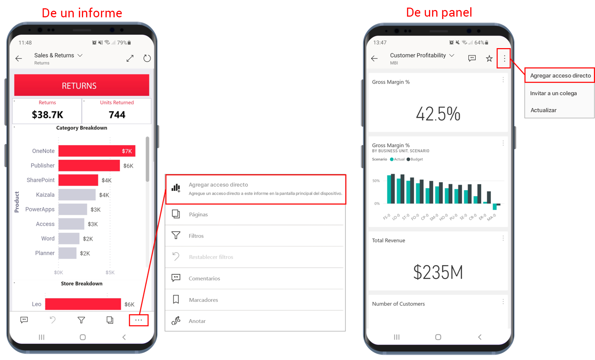
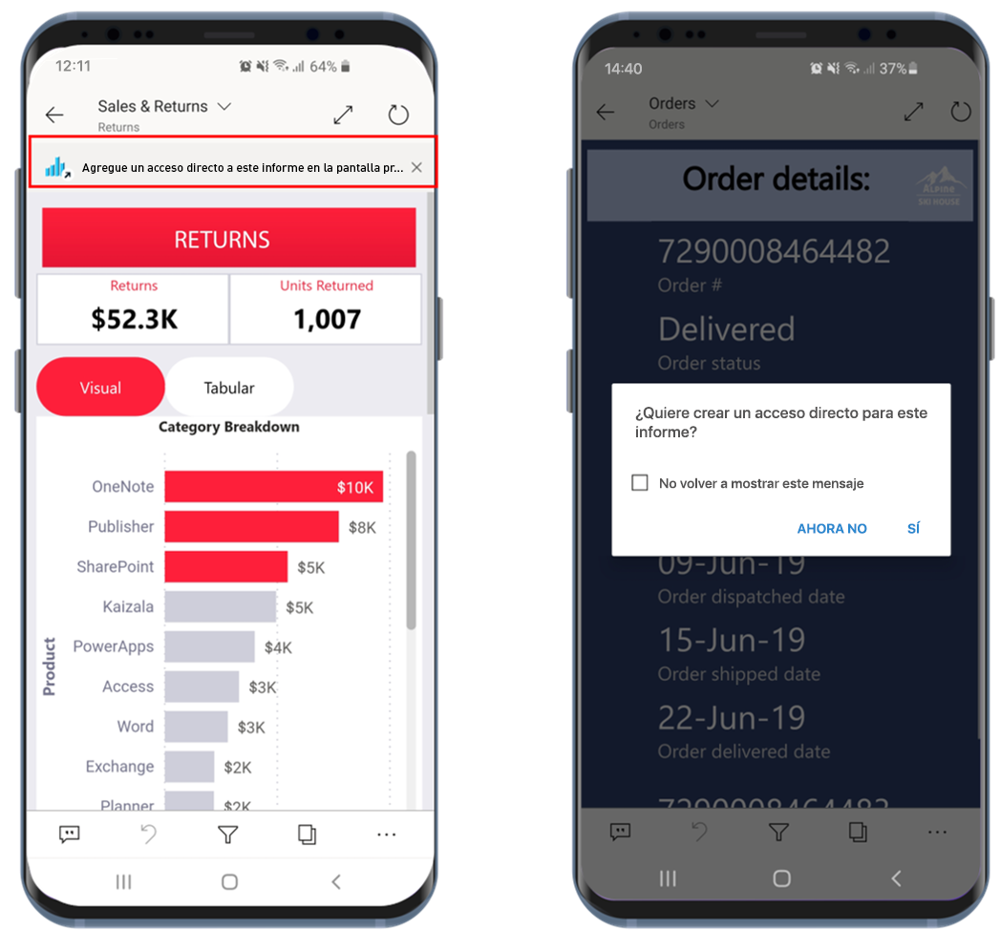
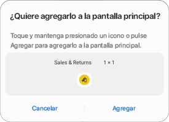
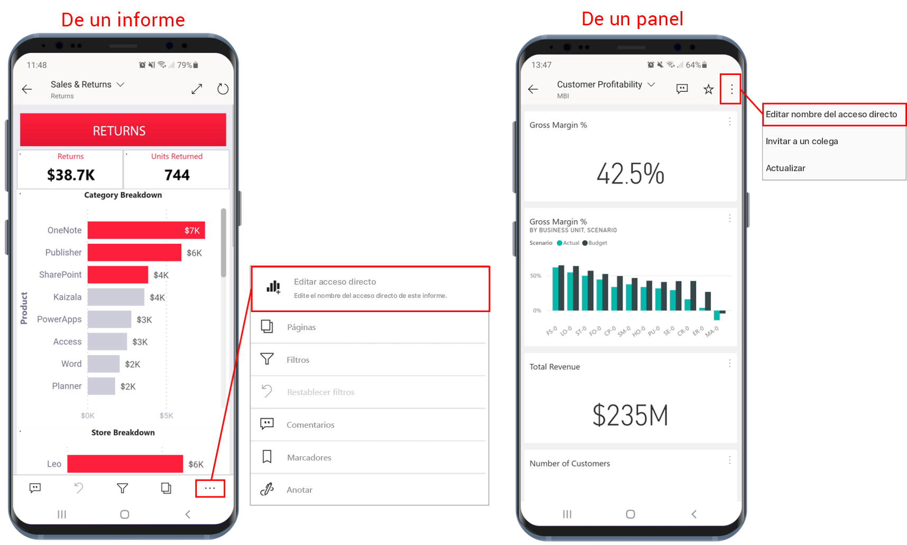
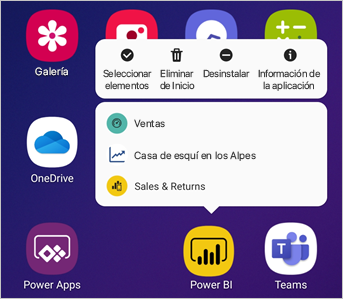

# Uso de accesos directos a aplicaciones Android en la aplicación Power BI para Android

Se aplica a:

|  |  |
|:--- |:--- |
| Teléfonos Android |Tabletas Android |

La aplicación móvil de Power BI para Android proporciona dos maneras sencillas de ir directamente a los informes o paneles que necesita, sin tener que navegar por la aplicación: **accesos directos a la pantalla principal del dispositivo** y **accesos directos del iniciador de aplicaciones**.
 * **Accesos directos a la pantalla principal del dispositivo**: se puede crear un acceso directo a cualquier informe o panel y anclarlo a la pantalla principal del dispositivo. No es necesario que el informe o el panel estén en una de las áreas de trabajo: también se pueden crear accesos directos a los informes y paneles que se encuentren dentro de las aplicaciones, o incluso a los que se encuentren en un inquilino externo (B2B).
 * **Accesos directos del iniciador de aplicaciones**: se puede acceder directamente a los informes y paneles vistos frecuentemente. Para ello, basta con hacer una pulsación larga en el icono del iniciador de aplicaciones de la pantalla principal del dispositivo con el fin de abrirlo. Un menú de acceso rápido proporciona accesos directos a tres elementos vistos frecuentemente. Estos elementos cambian de vez en cuando: la aplicación móvil Power BI realiza un seguimiento de lo que se está viendo a menudo y cambia los accesos directos en consecuencia.

 >[!NOTE]
 >Los accesos directos a aplicaciones Android están disponibles en Android 8 y versiones posteriores.

## Creación de un acceso directo a cualquier informe o panel

Se pueden crear accesos directos a cualquier informe o panel.

1. En un informe, en el menú Acciones, haga clic en **Más opciones...** y seleccione **Agregar acceso directo**. En un panel, pulse **Agregar acceso directo** en el menú Acciones.

   

   Además, si la aplicación Power BI observa que a menudo accede a un elemento, le sugerirá crear un acceso directo al elemento. Esto sucede de dos maneras:
   * En los informes y paneles vistos frecuentemente, la opción **Agregar acceso directo** aparecerá en un banner al abrir el elemento.
   * Si usa con frecuencia un vínculo para obtener acceso a un informe (por ejemplo, desde un correo electrónico compartido, una anotación, etc.), después de usar varias veces este vínculo, se abrirá una ventana en la que se le preguntará si quiere crear un acceso directo. La opción **Sí** abrirá el cuadro de diálogo **Agregar acceso directo** (véase a continuación), mientras que la opción **Ahora no** seguirá llevándole al elemento al que estaba intentando acceder.
   
   Debajo se muestran estas dos experiencias.

   

 1. Se mostrará una opción del cuadro de diálogo **Agregar acceso directo** con el nombre del elemento. Se puede editar el nombre si se quiere. Cuando termine, pulse **AGREGAR**.

    

1. Se le pedirá que confirme si quiere agregar el acceso directo. Pulse **AGREGAR** para incorporar el acceso directo a la pantalla principal del dispositivo.

   

   Se agregará un icono de panel de acceso directo o de informe a la pantalla principal del dispositivo con el nombre indicado.

   

## Edición del nombre del acceso directo

Para editar el nombre de un acceso directo, en el menú Acciones de nun informe, pulse **Más opciones...** y, después, elija **Editar el nombre de acceso directo**. En un panel, pulse **Agregar acceso directo**. Aparecerá el cuadro de diálogo **Editar nombre de acceso directo**.

 

## Uso del iniciador de aplicaciones móviles de Power BI para acceder al contenido visto frecuentemente

Se puede usar el iniciador de aplicaciones móviles de Power BI para ir directamente a los elementos a los que se accede con frecuencia.

Haga una pulsación larga en el iniciador de aplicaciones a fin de mostrar un menú de acceso rápido para los elementos vistos frecuentemente. Luego pulse en un acceso directo para abrir el elemento deseado.

Se puede crear un acceso directo permanente a cualquiera de los elementos de la lista. Para ello, arrastre el icono de acceso directo deseado a la pantalla principal del dispositivo.

## Pasos siguientes
* [Búsqueda de contenido y acceso a este con Google Search](mobile-app-find-access-google-search.md)
* Si está en iOS y busca accesos directos a Siri, vea [Uso de los métodos abreviados de Siri en la aplicación Power BI Mobile para iOS](mobile-apps-ios-siri-shortcuts.md).
* [Favoritos en las aplicaciones móviles de Power BI](mobile-apps-favorites.md)
