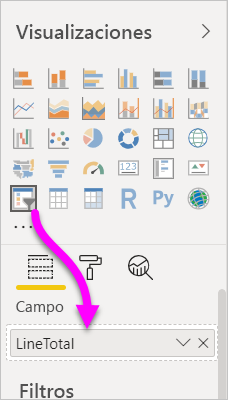
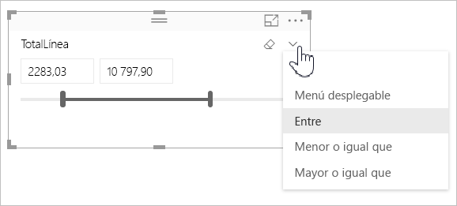
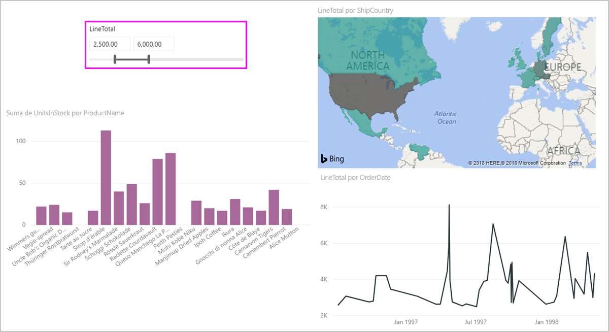
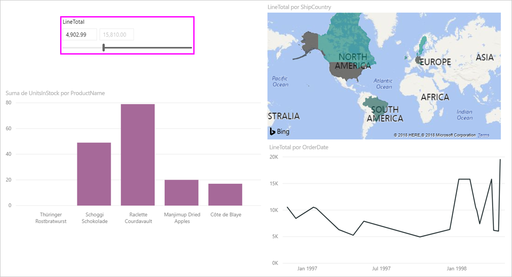

# Uso de la segmentación de intervalos numéricos en Power BI

[!INCLUDE [applies-to](../includes/applies-to.md)] [!INCLUDE [yes-desktop](../includes/yes-desktop.md)] [!INCLUDE [yes-service](../includes/yes-service.md)]

Con la segmentación de intervalos numéricos, puede aplicar todo tipo de filtros a cualquier columna numérica del modelo de datos. Hay tres opciones para filtrar los datos numéricos: entre números, menor o igual que un número, o mayor o igual que otro número. Esta sencilla técnica es una manera eficaz de filtrar los datos.

## vídeo

En este vídeo, se le guiará a través de la creación de una segmentación de rango numérico.

> [!NOTE]
> En este vídeo se usa una versión anterior de Power BI Desktop.

<iframe width="560" height="315" src="https://www.youtube.com/embed/zIZPA0UrJyA" frameborder="0" allowfullscreen></iframe> 

## Adición de una segmentación de intervalos numéricos

Puede usar la segmentación de intervalos numéricos igual que cualquier otra. Solo tiene que crear un objeto visual de **Segmentación** para el informe y, después, seleccionar un valor numérico para el valor **Campo**. En la imagen siguiente, se ha seleccionado el campo **LineTotal**.

Seleccione la flecha hacia abajo en la esquina superior derecha de la segmentación de intervalos numéricos y aparecerá un menú.

Para el intervalo numérico, puede seleccionar entre las tres opciones siguientes:

* **Entre**
* **Menor o igual que**
* **Mayor o igual que**

Al seleccionar **Entre** en el menú, aparece un control deslizante. Puede usar el control deslizante para seleccionar valores numéricos comprendidos entre los números. A veces, la granularidad de mover el control deslizante de la segmentación dificulta la elección exacta de ese número. También puede usar el control deslizante y seleccionar cualquiera de las casillas para escribir los valores que quiera. Esta opción es conveniente cuando se quieren realizar segmentaciones por números concretos.

En la imagen siguiente, la página de informe se filtra por los valores **LineTotal** comprendidos entre 2500,00 y 6000,00.

Cuando se selecciona **Menor o igual que**, desaparece el controlador de la izquierda (el valor inferior) de la barra del control deslizante y solo se puede ajustar el límite superior de la barra. En la imagen siguiente, la barra deslizante se establece en un máximo de 5928,19.

Por último, si selecciona **Mayor o igual que**, desaparece el controlador derecho de la barra del control deslizante (valor superior). Después, puede ajustar el valor inferior, como se aprecia en la imagen siguiente. Ahora, solo los elementos con un valor de **LineTotal** mayor o igual que 4902,99 se muestran en los objetos visuales de la página de informe.

## Ajuste a números enteros con la segmentación de intervalos numéricos

Una segmentación de rango numérico se ajusta a números enteros si el tipo de datos del campo subyacente es *Número entero*. Esta característica permite que la segmentación se alinee de forma limpia con números enteros. Los campos *Número decimal* permiten escribir o seleccionar fracciones de un número. El formato establecido en el cuadro de texto coincide con el establecido en el campo, aunque puede escribir o seleccionar números más precisos.

## Mostrar formato con la segmentación de datos de intervalo de fechas

Cuando se usa una segmentación para mostrar o establecer un intervalo de fechas, las fechas se muestran en el formato *Fecha corta*. La configuración regional del sistema operativo o el explorador del usuario determinan el formato de fecha. Por tanto, será el formato de presentación independientemente de la configuración del tipo de datos de los datos o el modelo subyacentes.

Por ejemplo, podría tener un formato de fecha larga para el tipo de datos subyacente. En este caso, un formato de fecha como *dddd, d de MMMM de yyyy* aplicaría formato a una fecha de otros objetos visuales o circunstancias como *miércoles, 14 de marzo de 2001*. Pero en la segmentación de intervalo de fechas, esa fecha se muestra como *14/03/2001*.

Mostrar el formato Fecha corta en la segmentación de datos garantiza que la longitud de la cadena sea coherente y compacta dentro de la segmentación de datos.

## Limitaciones y consideraciones

Las limitaciones y consideraciones siguientes se aplican a la segmentación de intervalos numéricos:

* La segmentación de intervalos numéricos filtra todas las filas subyacentes de los datos, pero no los valores agregados. Por ejemplo, imagine que usa un campo *Importe de venta*. Después, la segmentación filtra cada transacción en función del importe de venta, no la suma del importe de venta de cada punto de datos de un valor visual.
* En la actualidad no funciona con medidas.
* Puede escribir cualquier número en una segmentación numérica, aunque esté fuera del intervalo de valores de la columna subyacente. Esta opción le permite configurar filtros si sabe que los datos pueden cambiar en el futuro.
