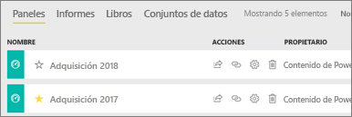

# Creación de una copia de un panel en el servicio Power BI

 Existen muchas razones diferentes para hacer una copia de un panel. Quizás desee realizar cambios y probar su rendimiento contra el original; o crear versiones ligeramente diferentes para distribuirlas por colega, región o equipo. Quizás un compañero admire el diseño de su panel y quiera usarlo para presentar informes a sus superiores. Otra razón podría ser que tenga una nueva base de datos con la misma estructura de datos y tipos de datos y desee reutilizar el panel que ya ha creado; aunque esto también podría hacerse, requeriría algún trabajo en Power BI Desktop. 

Los paneles se crean (y copian) con el servicio Power BI y se pueden ver en Power BI Mobile y Power BI Embedded.  Los paneles no están disponibles en Power BI Desktop. 

Para hacer una copia de un panel, debe ser el *creador* del panel. Los paneles que se haya compartido con usted, como una aplicación, no se pueden duplicar.

1. Abra el panel.
2. En la esquina superior derecha, seleccione **Más opciones** (...) y elija **Duplicar panel**.
   
   
3. Asigne al panel un nombre y seleccione **Duplicar**. 
   
   
4. El nuevo panel se guarda en la misma área de trabajo que el original. 
   
   

5.    Abra el nuevo panel y modifíquelo según sea necesario. Estas son algunas acciones que podría desear hacer a continuación:    
    a. [Mover, cambiar el nombre, cambiar el tamaño o incluso eliminar iconos](service-dashboard-edit-tile.md).  
    b. Editar los detalles del icono y los hipervínculos seleccionando el icono de **Más opciones** (...) y **Editar detalles**.  
    c. [Agregar nuevos iconos desde la barra de menús del panel](service-dashboard-add-widget.md) (**Agregar icono**)  
    d. Anclar nuevos iconos [desde Preguntas y respuestas](service-dashboard-pin-tile-from-q-and-a.md) o [desde los informes](service-dashboard-pin-tile-from-report.md).  
    e. Cambiar el nombre del panel, activar o desactivar Preguntas y respuestas y establecer el flujo del icono desde el panel de configuración del panel.  (seleccione la lista desplegable **Más opciones** (...) del panel y elija **Configuración**)  
    f. Compartir el panel directamente con los compañeros de trabajo o como parte de una aplicación de Power BI. 

## Pasos siguientes
* [Sugerencias para diseñar un panel de Power BI fantástico](service-dashboards-design-tips.md) 

¿Tiene más preguntas? [Pruebe la comunidad de Power BI](https://community.powerbi.com/)

