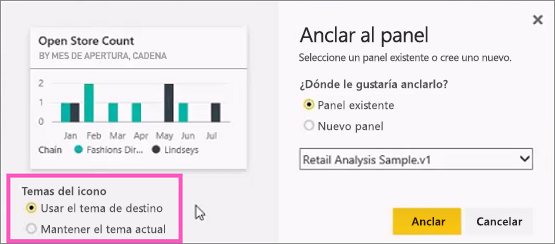

# Anclaje de un icono a un panel de Power BI desde un informe

Una manera de agregar un nuevo [icono del panel](../consumer/end-user-tiles.md) es desde un [informe de Power BI](../consumer/end-user-reports.md). Al seleccionar uno de estos iconos, se abre en el informe.

Se puede anclar una página de informe completa a un panel, lo que se denomina anclar un icono *dinámico*. Se le llama icono dinámico porque puede interactuar con el icono en el panel. A diferencia de los iconos de visualización individuales, los cambios que haga en el informe se sincronizan automáticamente con el panel. Para más información, consulte [Anclar una página de informe completa](#pin-an-entire-report-page).

No puede anclar iconos desde informes que han compartido con usted ni desde Power BI Desktop. 

> [!TIP]
> Dado que algunas visualizaciones utilizan imágenes de fondo, es posible que el anclaje no funcione si la imagen de fondo es demasiado grande. Intente reducir el tamaño de la imagen o utilice la compresión de imágenes.  
> 
> 

## Anclar un icono desde un informe
Vea cómo Amanda crea un panel con objetos visuales e imágenes anclados desde un informe de Power BI.
    

<iframe width="560" height="315" src="https://www.youtube.com/embed/lJKgWnvl6bQ" frameborder="0" allowfullscreen></iframe>

Ahora, cree su propio panel con uno de los informes de ejemplo de Power BI.

1. En el informe, mantenga el puntero sobre la visualización que quiera anclar y seleccione el icono de anclaje. . Power BI abre la pantalla **Anclar en el panel** .
   
     
2. Seleccione si va a anclar el icono a un panel existente o a uno nuevo.
   
   * **Panel existente**: Seleccione el nombre del panel en la lista desplegable. Los paneles compartidos con usted no aparecerán en la lista desplegable.
   * **Nuevo panel**: Escriba el nombre del nuevo panel.
3. En algunos casos, puede que el elemento que está anclando ya tenga un *tema* aplicado. Por ejemplo, objetos visuales anclados desde un libro de Excel. Si es así, seleccione el tema que se debe aplicar al icono.
4. Seleccione **Anclar**.
   
   Cerca de la esquina superior derecha aparecerá un mensaje de confirmación que le indicará que la visualización se ha agregado al panel como un icono.
   
   
5. En el panel de navegación, seleccione el panel con el nuevo icono. [Edite la presentación y el comportamiento del icono](service-dashboard-edit-tile.md) o seleccione el icono para volver al informe.

## Anclar una página de informe completa
Otra opción es anclar una página de informe completa a un panel, que es una manera fácil de anclar más de una visualización a la vez. Si ancla una página completa, los iconos serán *dinámicos*. Es decir, puede interactuar con ellos desde allí o desde el panel. Los cambios que haga en cualquier visualización del editor de informes, como agregar un filtro o cambiar los campos utilizados en el gráfico, se reflejan también en el icono del panel.  

Para más información, consulte [Anclar una página de informe completa](service-dashboard-pin-live-tile-from-report.md).

> [!NOTE]
> Algunas opciones de formato no se aplican a los objetos visuales cuando están anclados a un panel. La configuración de borde, sombra y fondo se omitirá en el icono anclado. En el caso de los objetos visuales de tarjeta, el texto utilizado para el valor siempre se muestra en los paneles mediante la familia de fuentes "DIN". 
> 
>

## Pasos siguientes
- [Dashboards for Power BI service consumers](../consumer/end-user-dashboards.md) (Paneles para los consumidores del servicio Power BI)
- [Iconos de paneles en Power BI](../consumer/end-user-tiles.md)
- [Informes en Power BI](../consumer/end-user-reports.md)
- [Actualizar datos en Power BI](../connect-data/refresh-data.md)
- [Conceptos básicos para los diseñadores en el servicio Power BI](../fundamentals/service-basic-concepts.md)

¿Tiene más preguntas? [Pruebe la comunidad de Power BI](https://community.powerbi.com/)
