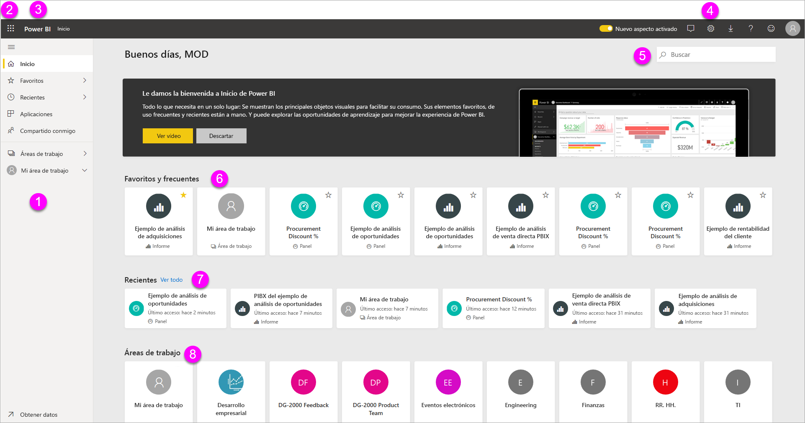
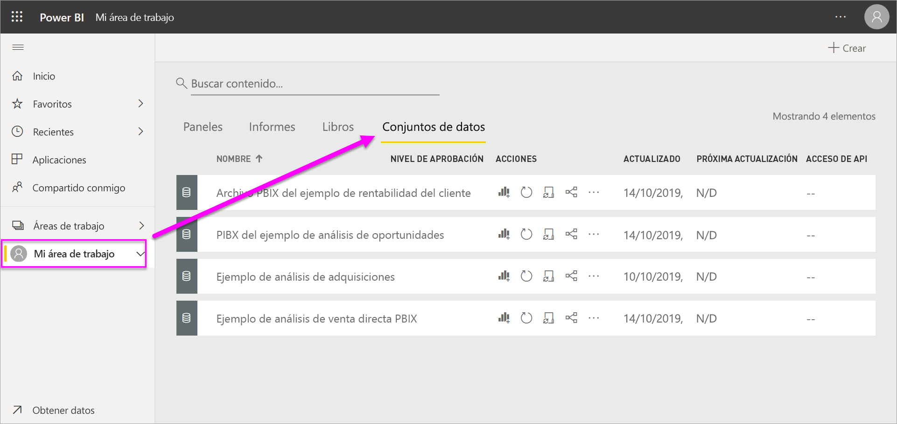
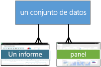
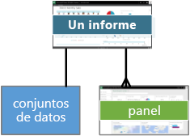
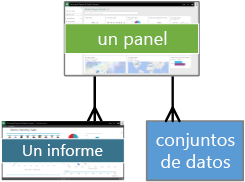
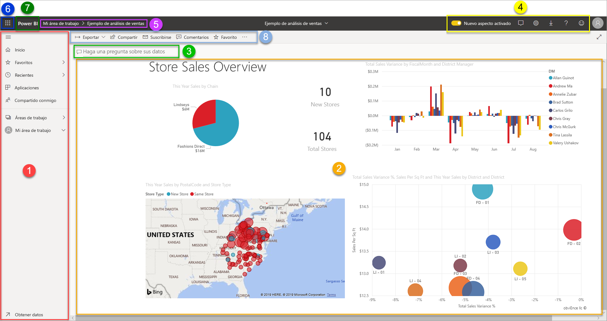
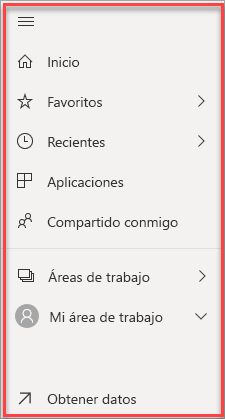

# Conceptos básicos para los diseñadores en el servicio Power BI

El objetivo de este artículo es orientarle sobre el servicio Power BI: cuáles son los diferentes elementos, cómo funcionan conjuntamente y cómo puede trabajar con ellos. Podrá aprovecharlo al máximo si ya se ha [registrado en el servicio Power BI](service-self-service-signup-for-power-bi.md) y ha [agregado algunos datos](../connect-data/service-get-data.md). Como diseñador, su flujo de trabajo típico consiste normalmente en empezar creando informes en Power BI Desktop. A continuación, los publica en el servicio Power BI, donde puede continuar modificándolos. También crea los paneles basados en sus informes en el servicio Power BI. 

En este artículo, si aún no tiene sus propios informes, pruebe a instalar uno de los [ejemplos de Power BI](../create-reports/sample-datasets.md).

Cuando abra el servicio Power BI en un explorador, empezará en su pantalla Inicio. Estos son los elementos que puede ver:

1. Panel de navegación
2. Iniciador de aplicaciones de Microsoft 365
3. Botón Inicio de Power BI
4. Botones de iconos, incluidos los de configuración, ayuda y comentarios
5. Cuadro de búsqueda
6. Áreas de trabajo, informes y paneles favoritos y frecuentes
7. Áreas de trabajo, informes y paneles recientes
8. Sus áreas de trabajo

Usted y los usuarios finales de sus informes y paneles tienen la misma experiencia de inicio en el servicio Power BI de un explorador.

Más adelante se explicarán estas características de forma detallada, pero primero analizaremos algunos conceptos de Power BI. O bien, es posible que desee ver este vídeo primero.  En el vídeo, Will da un repaso a los conceptos básicos y muestra el servicio Power BI.

<iframe width="560" height="315" src="https://www.youtube.com/embed/B2vd4MQrz4M" frameborder="0" allowfullscreen></iframe>

## Conceptos de Power BI
Los cinco pilares principales de Power BI son los *paneles*, los *informes*, los *libros*, los *conjuntos de datos* y los *flujos de datos*. Todos se organizan en *áreas de trabajo* y se crean en las *capacidades*.  Es importante comprender qué son las áreas de trabajo y las capacidades antes de profundizar en los cuatro bloques de creación, así que vamos a empezar por ahí.

## Capacidades
Las capacidades son un concepto básico de Power BI que representa un conjunto de recursos (almacenamiento, procesador y memoria) que se usan para hospedar y facilitar el contenido de Power BI. Las capacidades son _compartidas_ o _dedicadas_. Una capacidad compartida es la que se comparte con otros clientes de Microsoft, mientras que una dedicada está confirmada plenamente para un solo cliente. Las capacidades dedicadas requieren una [suscripción](../admin/service-premium-what-is.md) y se describen detalladamente en el artículo [Administración de las capacidades Premium](../admin/service-premium-capacity-manage.md).

De forma predeterminada, las áreas de trabajo se crean en una capacidad compartida. En la capacidad compartida, las cargas de trabajo se ejecutan en recursos informáticos compartidos con otros clientes. Como la capacidad debe compartir recursos, se imponen ciertas limitaciones para garantizar un "juego limpio", como un tamaño de modelo máximo (1 GB) y una frecuencia de actualización diaria máxima (ocho veces al día).

## Áreas de trabajo
Las áreas de trabajo se crean en las capacidades. Básicamente, son contenedores de paneles, informes, libros, conjuntos de datos y flujos de datos de Power BI.

Existen dos tipos de áreas de trabajo: *Mi área de trabajo* y las *áreas de trabajo*.

- *Mi área de trabajo* es el área de trabajo personal de cualquier cliente de Power BI en la que puede trabajar con su contenido. Solo usted tiene acceso a esta área de trabajo. Puede compartir paneles e informes desde Mi área de trabajo. Si desea colaborar en paneles e informes o crear una aplicación, querrá trabajar en un área de trabajo.      
-  Las *áreas de trabajo* se usan para colaborar y compartir el contenido con los compañeros. Puede agregar compañeros a las áreas de trabajo y colaborar en paneles, informes, libros y conjuntos de datos. Excepto en un caso concreto, todos los miembros del área de trabajo necesitan licencias de Power BI Pro. Más información sobre las [nuevas áreas de trabajo](../collaborate-share/service-create-the-new-workspaces.md). 

    Las áreas de trabajo también son los lugares donde puede crear, publicar y administrar *aplicaciones* para su organización. Entienda las áreas de trabajo como áreas de almacenamiento provisional y contenedores del contenido que compondrá una aplicación de Power BI. ¿Qué es una *aplicación*? Es una colección de paneles e informes creada para presentar las métricas clave a los consumidores de Power BI de su organización. Las aplicaciones son interactivas, pero los consumidores no pueden editarlas. Los consumidores de la aplicación (los compañeros que tienen acceso a las aplicaciones) no las necesitan.  

Para más información sobre el uso compartido en general, empiece por [Ways to share dashboards your work](../collaborate-share/service-how-to-collaborate-distribute-dashboards-reports.md) (Formas de compartir paneles en los que trabaja).

Ahora pasemos a los cinco pilares principales de Power BI.

## Flujos de datos
Un *flujo de datos* ayuda a las organizaciones a unificar los datos de orígenes dispares. Son opcionales y se suelen usar en proyectos complejos o grandes. Representan los datos preparados y agregados a una fase intermedia para su uso en conjuntos de datos. Sin embargo, no se pueden usar directamente como origen para la creación de informes. Aprovechan la amplia colección de conectores de datos de Microsoft, lo que permite la ingesta de datos de orígenes de datos locales y basados en la nube.

Los flujos de datos solo se crean y se administran en áreas de trabajo (pero no en *Mi área de trabajo*) y se almacenan como entidades en Common Data Model (CDM) en Azure Data Lake Storage Gen2. Normalmente, están programados para actualizarse de forma periódica para almacenar datos actualizados. Son ideales para preparar los datos para su uso (y para una posible reutilización) en conjuntos de datos. Para obtener más información, vea el artículo [Autoservicio de preparación de los datos en Power BI](../transform-model/service-dataflows-overview.md).

No se pueden tener paneles ni informes sin datos. En realidad, sí que es posible, pero los paneles y los informes no serán útiles hasta que tengan datos. Es por eso que comenzaremos con los **conjuntos de datos**.

## Conjuntos de datos
Un *conjunto de datos* es una colección de datos que *importa* o a lo que se *conecta*. Power BI permite importar y conectar con todos los tipos de conjuntos de datos y ponerlos todos en un solo lugar. Los conjuntos de datos también pueden obtener datos de flujos de datos.

Los conjuntos de datos están asociados a *áreas de trabajo* y un único conjunto de datos puede formar parte de muchas áreas de trabajo. Cuando se abre un área de trabajo, los conjuntos de datos asociados aparecen en la pestaña **Conjuntos de datos**. Cada conjunto de datos de la lista representa un origen de datos, por ejemplo, un libro de Excel en OneDrive, un conjunto de datos tabulares locales de SSAS o una base de datos de Salesforce. Hay muchos orígenes de datos compatibles diferentes y estamos agregando nuevos todo el tiempo. Consulte la lista de [tipos de conjuntos de datos que se pueden usar con Power BI.](../connect-data/service-get-data.md)

En el ejemplo siguiente, he seleccionado el área de trabajo "Sales and marketing" y he hecho clic en la pestaña **Conjuntos de datos**.

**Un único** conjunto de datos...

* puede utilizarse una y otra vez en una o varias áreas de trabajo.
* se puede usar en muchos informes diferentes.
* Las visualizaciones de ese conjunto de datos se pueden mostrar en muchos paneles diferentes.

  

Para [importar o conectarse a un conjunto de datos](../connect-data/service-get-data.md), seleccione **Obtener datos** en la parte inferior del panel de navegación. Siga las instrucciones para importar o conectarse al origen específico y agregue el conjunto de datos al área de trabajo activa. Los nuevos conjuntos de datos se marcan con un asterisco amarillo. El trabajo que realice en Power BI no cambiará el conjunto de datos subyacente.

Los conjuntos de datos que agrega un miembro del área de trabajo están disponibles para otros miembros del área de trabajo con un rol de *administrador*, *miembro* o *colaborador*.

Los conjuntos de datos se pueden actualizar, cambiar de nombre, explorar y eliminar. Use un conjunto de datos para crear un informe desde cero o mediante la ejecución de [información rápida](../create-reports/service-insights.md).  Para ver qué informes y paneles ya están usando un conjunto de datos, seleccione **Ver relacionados**. Para explorar un conjunto de datos, selecciónelo. Lo que realmente hace es abrir el conjunto de datos en el editor de informes, donde puede empezar realmente a profundizar en los datos mediante la creación de visualizaciones.

Ahora, pasemos al siguiente tema: los informes.

### Análisis en profundidad
* [Conjuntos de datos en el servicio Power BI](../connect-data/service-datasets-understand.md)
* [Modos de conjuntos de datos en el servicio Power BI](../connect-data/service-dataset-modes-understand.md)
* [¿Qué es Power BI Premium?](../admin/service-premium-what-is.md)
* [Obtener datos para Power BI](../connect-data/service-get-data.md)
* [Conjuntos de datos de ejemplo para Power BI](../create-reports/sample-datasets.md)

## Informes
Un informe de Power BI se compone de una o más páginas de visualizaciones, como gráficos de líneas, mapas y gráficos de rectángulos. A las visualizaciones también se les denomina **_objetos visuales_**. Todas las visualizaciones de un informe proceden de un único conjunto de datos. Se pueden crear informes desde cero en Power BI, se pueden importar con paneles que otros compañeros compartan con usted o se pueden crear en Power BI mediante la conexión a conjuntos de datos de Excel, Power BI Desktop, bases de datos y aplicaciones SaaS.  Por ejemplo, cuando se conecta a un libro de Excel que contiene hojas de Power View, Power BI crea un informe basado en dichas hojas. Y cuando se conecta a una aplicación de SaaS, Power BI importa un informe previamente creado.

Hay dos maneras de ver los informes e interactuar con ellos: *Vista de lectura* y *vista de edición*. Al abrir un informe, se abre en la vista de lectura. Si tiene permisos de edición, verá **Editar informe** en la esquina superior izquierda y podrá ver el informe en la vista de edición.  Si un informe se encuentra en un área de trabajo, todos los usuarios con un rol de *administrador*, *miembro* o *colaborador* pueden editarlo. Estos usuarios tienen acceso a todas las funcionalidades de exploración, diseño, creación y uso compartido de ese informe en la vista de edición. Las personas con las que comparta el informe pueden explorarlo e interactuar con él mediante la vista de lectura.   

Cuando se abre un área de trabajo, los informes asociados aparecen en la pestaña **Informes**. Cada informe de la lista representa una o más páginas de visualizaciones basadas en solo uno de los conjuntos de datos subyacentes. Para abrir un informe, selecciónelo.

Cuando abre una aplicación, se le muestra un panel.  Para acceder a un informe subyacente, seleccione un icono del panel (se proporciona más información sobre los iconos más adelante) que se ha anclado desde un informe. Tenga en cuenta que no todos los iconos se anclan desde los informes, por lo que tendrá que hacer clic en unos cuantos iconos para encontrar un informe.

De forma predeterminada, el informe se abre en la Vista de lectura.  Simplemente seleccione **Editar informe** para abrirlo en la vista de edición (si tiene los permisos necesarios).

En el ejemplo siguiente, he seleccionado el área de trabajo "Sales and marketing" y he hecho clic en la pestaña **Informes**.

**UN** informe...

* se encuentra en una misma área de trabajo.
* se puede asociar con varios paneles dentro de ese área de trabajo. Los iconos anclados desde ese informe pueden aparecer en varios paneles.
* se puede crear con los datos de un conjunto de datos. Power BI Desktop puede combinar más de un conjunto de datos en un único informe, y ese informe se puede importar en Power BI.

  

### Análisis en profundidad
- [Creación de un informe en el servicio Power BI mediante la importación de un conjunto de datos](../create-reports/service-report-create-new.md)
- [Optimización de informes para las aplicaciones móviles de Power BI](../create-reports/desktop-create-phone-report.md)

## Paneles
Un *panel* es algo que usted crea **en el servicio Power BI** o que un compañero de trabajo crea **en este** y comparte con usted. Es un lienzo individual que contiene uno o varios iconos y widgets. Cada icono anclado desde un informe o desde [Preguntas y respuestas](../consumer/end-user-q-and-a.md) muestra una [visualización](../visuals/power-bi-report-visualizations.md) única creada a partir de un conjunto de datos y anclada al panel. Además, pueden anclarse páginas de informe completas a un panel como un único icono. Hay muchas maneras de agregar iconos al panel; demasiadas para tratarlas en este tema de información general. Para más información, vea [Iconos del panel en Power BI](../create-reports/service-dashboard-tiles.md).

¿Por qué se crean paneles?  Estas son solo algunas de las razones:

* para observar de un solo vistazo toda la información necesaria para tomar decisiones.
* para supervisar la información más importante sobre su empresa.
* para garantizar que todos los compañeros estén en la misma sintonía, es decir, que vean y usen la misma información.
* para supervisar el correcto funcionamiento de un negocio, producto, unidad de negocio, campaña de marketing, etc.
* para crear una vista personalizada de un panel más grande (con las métricas importantes para usted).

Cuando se abre un área de trabajo, los paneles asociados aparecen en la pestaña **Paneles**. Para abrir un panel, selecciónelo. Cuando abre una aplicación, se le muestra un panel.  Cada panel representa una vista personalizada de algún subconjunto de los conjuntos de datos subyacentes.  Si es el propietario del panel, también tendrá acceso de edición a los conjuntos de datos e informes subyacentes.  Si el panel se ha compartido con usted, podrá modificar el panel y los informes subyacentes, pero no podrá guardar los cambios.

Hay muchas maneras diferentes mediante las que usted o un compañero de trabajo pueden [compartir un panel](../collaborate-share/service-share-dashboards.md). Power BI Pro es necesario para compartir un panel y puede que sea necesario para ver un panel compartido.

**UN** panel...

* está asociado a una única área de trabajo
* puede mostrar visualizaciones de muchos conjuntos de datos diferentes
* puede mostrar visualizaciones de muchos informes diferentes
* puede mostrar visualizaciones ancladas desde otras herramientas (por ejemplo, Excel)

  

### Análisis en profundidad
* [Cree un panel en blanco y, luego, obtenga algunos datos](../create-reports/service-dashboard-create.md).
* [Duplicar un panel](../create-reports/service-dashboard-copy.md)
* [Crear una vista de teléfono de un panel](../create-reports/service-create-dashboard-mobile-phone-view.md)

## Libros
Los libros son un tipo especial de conjunto de datos. Si ha leído la sección anterior **Conjuntos de datos**, sabrá casi todo lo que necesita saber acerca de los libros. Pero quizás se pregunte por qué a veces, Power BI clasifica un libro de Excel como un **conjunto de datos** y otras veces como un **libro**.

Cuando usa **Obtener datos** con archivos de Excel, tiene la opción de *Importar* o *Conectarse* al archivo. Si elige Conectar, aparecerá el libro en Power BI tal como lo haría en Excel Online. Sin embargo, a diferencia de Excel Online, podrá disfrutar de algunas funciones fantásticas que le ayudarán a anclar elementos de las hojas de cálculo directamente en los paneles.

No puede editar el libro en Power BI, pero si necesita realizar algunos cambios, haga clic en Editar y, a continuación, edite el libro en Excel Online o ábralo en Excel en el equipo. Todos los cambios que realice se guardarán en el libro en OneDrive.

### Análisis en profundidad
* [Obtención de datos de archivos de libro de Excel](../connect-data/service-excel-workbook-files.md)
* [Publicación en Power BI desde Excel 2016](../connect-data/service-publish-from-excel.md)

## Panel en Mi área de trabajo
Se han analizado áreas de trabajo y bloques de creación. Vamos a aunarlo todo y a revisar las partes que conforman la experiencia de panel en el servicio Power BI.

### 1. **Panel de navegación**
Use el panel de navegación para localizar y moverse entre las áreas de trabajo y los bloques de creación de Power BI: paneles, informes, libros y conjuntos de datos.  

  

* Seleccione **Obtener datos** para [agregar conjuntos de datos, informes y paneles a Power BI](../connect-data/service-get-data.md).
* Expanda y contraiga el panel de navegación con este icono .
* Abra o administre su contenido favorito seleccionando **Favoritos**.
* Vea y abra los últimos contenidos que ha visitado seleccionando **Reciente**.
* Vea, abra o elimine una aplicación mediante **Aplicaciones**.
* ¿Ha compartido contenido un compañero con usted? Seleccione **Compartido conmigo** para buscar y ordenar ese contenido para encontrar lo que necesita.
* Haga clic en **Áreas de trabajo** para mostrar y abrir las áreas de trabajo.

Haga clic en estos elementos:

* en un icono o título para abrir en la vista de contenido
* en una flecha derecha (>) para abrir un menú flotante de Favoritos, Recientes y Áreas de trabajo.
* un icono de comillas angulares para mostrar la lista desplazable **Mi área de trabajo** con los paneles, informes, libros y conjuntos de datos.

### 2. **Lienzo**
Dado que se ha abierto un panel, el área del lienzo muestra los iconos de la visualización. Si, por ejemplo, se hubiera abierto el editor de informes, el área del lienzo mostraría una página del informe.

Los paneles se componen de [iconos](../create-reports/service-dashboard-tiles.md).  Los iconos se crean en la vista de edición del informe, en preguntas y respuestas, y en otros paneles, y se pueden anclar desde Excel, SSRS y muchos otros. Un tipo especial de icono, llamado [widget](../create-reports/service-dashboard-add-widget.md), se agrega directamente al panel. Los iconos que aparecen en un panel los colocó específicamente ahí el creador/propietario del informe.  La acción de agregar un icono a un panel se denomina *anclar*.

Para obtener más información, consulte [Paneles](#dashboards) (arriba).

### 3. **Cuadro de preguntas y respuestas**
Una manera de explorar los datos consiste en formular una pregunta y permitir que Preguntas y respuestas de Power BI proporcione una respuesta en la forma de una visualización. Se puede usar Preguntas y respuestas para agregar contenido a un panel o informe.

Preguntas y respuestas busca una respuesta en los conjuntos de datos conectados al panel.  Un conjunto de datos conectado es aquel que tiene al menos un icono anclado a ese panel.

Tan pronto como empieza a escribir la pregunta, Preguntas y respuestas lo dirige a la página de Preguntas y respuestas. A medida que escribe, Preguntas y respuestas le ayuda a formular la pregunta correcta y a encontrar la mejor respuesta a través de sus funciones para reformular, autorellenar, hacer sugerencias y mucho más. Cuando tenga una visualización (respuesta) satisfactoria, la puede anclar al panel. Para más información, consulte [Preguntas y respuestas en Power BI](../consumer/end-user-q-and-a.md).

### 4. **Iconos en la barra de encabezado negra**
Los iconos en la esquina superior derecha dan acceso al equipo de Power BI a las opciones de configuración, notificaciones, descargas, ayuda, activación o desactivación del **Nuevo aspecto** y aportación de comentarios.  

### 5. **Título del panel** (ruta de navegación)
No siempre es fácil averiguar qué áreas de trabajo y paneles están activos. Por eso, Power BI crea una ruta de navegación para usted.  En este ejemplo se muestra el área de trabajo (Mi área de trabajo) y el título del panel (Ejemplo de análisis de minoristas).  Si se abre un informe, el nombre de este se anexa al final de la ruta de navegación.  Cada sección de la ruta de acceso es un hipervínculo activo.  

Observe el icono "C" después del título del panel. Este panel tiene una [etiqueta de clasificación de datos](../create-reports/service-data-classification.md) que pone "confidencial". La etiqueta permite identificar la confidencialidad y el nivel de seguridad de los datos. Si el administrador ha activado la clasificación de datos, cada panel tendrá un conjunto de etiquetas predeterminado. Los propietarios del panel deben cambiar la etiqueta para que coincida con el nivel de seguridad apropiado de su panel.

### 6. **Iniciador de aplicaciones de Microsoft 365**
Con el iniciador de aplicaciones, todas las aplicaciones de Microsoft 365 están disponibles fácilmente con un solo clic. Desde aquí, puede iniciar rápidamente el correo electrónico, los documentos, el calendario y mucho más.

### 7. **Inicio de Power BI**
Si hace clic en **Power BI**, vuelve al inicio de Power BI.

   

### 8. **Iconos con etiqueta en la barra de menús gris**
Esta área de la pantalla contiene opciones adicionales para interactuar con el contenido (en este caso, con el panel).  Además de los iconos con etiqueta que puede ver, si selecciona **Más opciones (...)** aparecerán opciones para duplicar, imprimir y actualizar el panel, entre otras.

   

## Pasos siguientes
- [¿Qué es Power BI?](power-bi-overview.md)  
- [Vídeos de Power BI](videos.md)  
- [Un paseo por el editor de informes](../create-reports/service-the-report-editor-take-a-tour.md)
- ¿Tiene más preguntas? [Pruebe a preguntar a la comunidad de Power BI](https://community.powerbi.com/)
