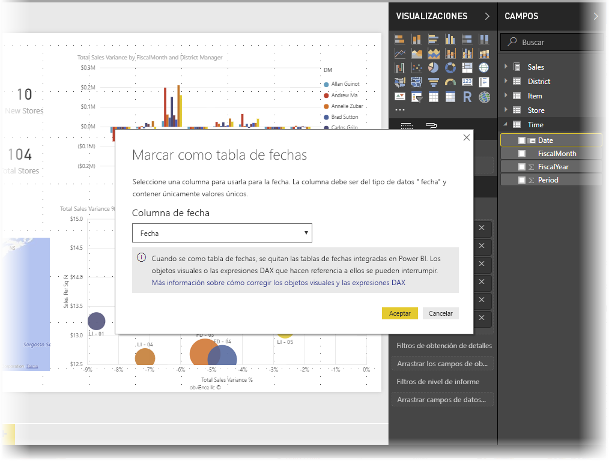
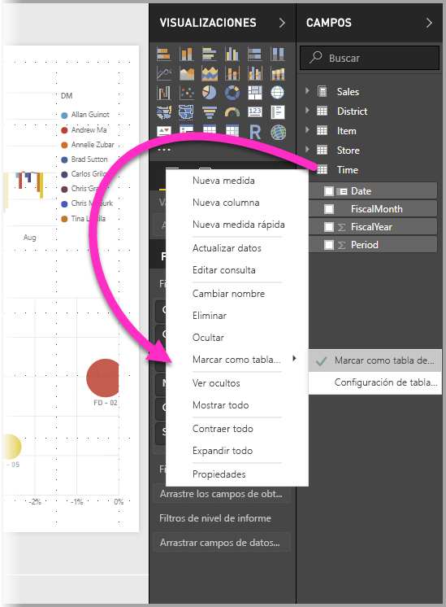
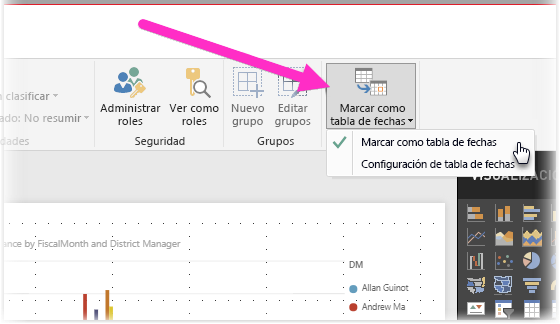
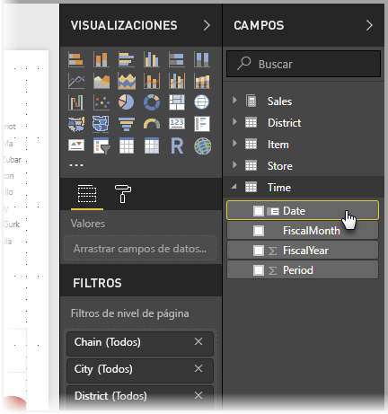
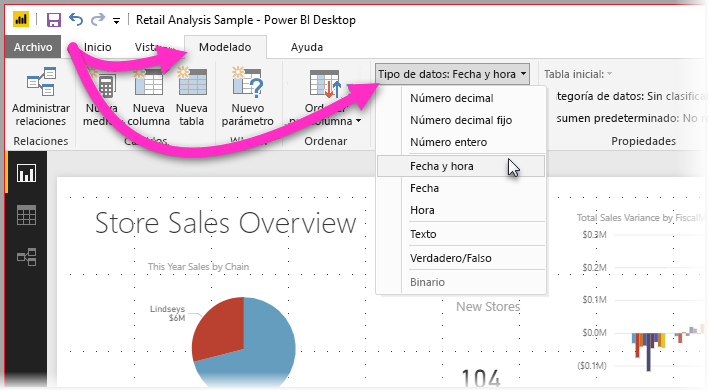

# Configuración y uso de tablas de fechas en Power BI Desktop

**Power BI Desktop** funciona en segundo plano para identificar automáticamente columnas que representan fechas y, luego, crea jerarquías de fechas y otros metadatos propicios para su modelo de forma automática. Luego puede usar dichas jerarquías integradas para crear características de informes como elementos visuales, tablas, medidas rápidas, segmentaciones, etc. Para ello, Power BI Desktop crea tablas ocultas de manera automática que luego el usuario puede utilizar para sus informes y expresiones de DAX.

Para más información sobre este comportamiento automático, lea el artículo [Fecha y hora automáticas en Power BI Desktop](desktop-auto-date-time.md).

Muchos analistas de datos prefieren crear sus propias tablas de fechas, lo cual es perfectamente válido. En **Power BI Desktop**, puede especificar la tabla que quiera para que su modelo la use como **tabla de fechas** y, después, crear objetos visuales, tablas, medidas rápidas, etc. relacionados con las fechas utilizando los datos de fechas de la tabla. Cuando se especifique su propia tabla de fechas, tendrá el control de las jerarquías de fechas creadas en su modelo, y las usará en las **medidas rápidas** y otras operaciones que utilizan la tabla de fechas de su modelo. 

## Configuración de su propia tabla de fechas

Para configurar una **tabla de fechas**, seleccione la tabla que desea usar como tabla de fechas en el panel **Campos**, luego haga clic con el botón derecho en la tabla y seleccione **Marcar como tabla de fechas > Marcar como tabla de fechas** en el menú que aparece, tal como se muestra en la siguiente imagen.

También puede seleccionar la tabla y, a continuación, seleccionar **Marcar como tabla de fechas** desde la cinta de opciones **Modelado**, que se muestra aquí.

Al especificar su propia **tabla de fechas**, Power BI Desktop realiza las siguientes validaciones de esa columna y sus datos, para asegurarse de que los datos:

* contienen valores únicos
* contienen valores que no son nulos
* contienen valores de fechas contiguas (de principio a fin)
* tienen la misma marca de tiempo en cada valor (si son del tipo **Fecha/Hora**)

Hay dos escenarios probables para la creación de su propia tabla de fechas, cualquiera de los cuales es una opción razonable:

* El primer escenario es cuando se usa una tabla de datos canónica, o básica, y jerarquía. Se trata de una tabla en los datos que cumple los criterios de validación descritos anteriormente para una tabla de fechas. 

* El segundo escenario es cuando se utiliza una tabla de Analysis Services, por ejemplo, con un campo *dim date* (fecha dim) que desea utilizar como tabla de fechas. 

Una vez especificada una tabla de fechas, puede seleccionar qué columna de la tabla es la columna de fecha. Para especificar qué columna se usará, seleccione la tabla del panel **Campo**, haga clic con el botón derecho en la tabla y seleccione **Marcar como tabla de fechas > Configuración de tabla de fechas**. Aparece la ventana siguiente, donde puede seleccionar la columna que se va a utilizar como tabla de fechas en el cuadro desplegable.

Es importante tener en cuenta que, cuando especifique su propia tabla de fechas, **Power BI Desktop** no creará automáticamente las jerarquías que de otro modo generaría en el modelo de manera automática. Si más adelante anula la selección de la tabla de fechas (y deja de tener una tabla de fechas configurada de manera manual), Power BI Desktop vuelve a crear las tablas de fechas integradas creadas automáticamente para las columnas de fecha en la tabla.

También es importante tener en cuenta que cuando se marca una tabla como tabla de fechas, se quita la tabla de fechas integrada (creada automáticamente) que creó Power BI Desktop, y los objetos visuales o expresiones de DAX que creó anteriormente con base en esas tablas integradas dejarán de funcionar correctamente. 

## Marcado de la tabla de fechas como tipo de datos apropiado

Al especificar su propia **tabla de fechas**, debe asegurarse de que el tipo de datos está configurado correctamente. Tiene que establecer el **Tipo de datos** en **Fecha y hora** o **Fecha**. Para ello, siga estos pasos:

1. Seleccione su **tabla de fechas** en el panel **Campos**, expanda, si fuera es necesario, y seleccione la columna que se usará como fecha.
   
     

2. En la pestaña **Modelado**, seleccione **Tipo de datos:** y, a continuación, haga clic en la flecha de la lista desplegable para mostrar los tipos de datos disponibles.

    

3. Especifique el tipo de datos para la columna. 

## Pasos siguientes

Para obtener más información sobre este artículo, consulte los recursos siguientes:

* [Fecha y hora automáticas en Power BI Desktop](desktop-auto-date-time.md)
* [Creación de tablas de fechas en Power BI Desktop](../guidance/model-date-tables.md)
* [Tipos de datos en Power BI Desktop](../connect-data/desktop-data-types.md)
* ¿Tiene alguna pregunta? [Pruebe a preguntar a la comunidad de Power BI](https://community.powerbi.com/)
* ¿Sugerencias? [Ideas para contribuir a mejorar Power BI](https://ideas.powerbi.com/)
